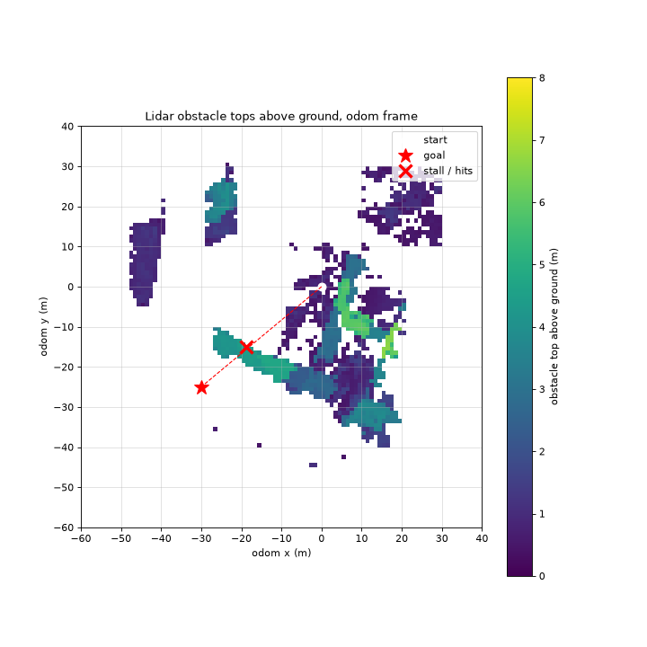

# Planner results on the XFS yard (6 Oct 2026)

MIGHTY and SUPER flown as components under test on `planner-xfs-mighty` (ArduPilot on XFS), on a
harder goal course than the onboarding demo. This page records what they did and why MIGHTY fails.

**Draft branch, not for merging into v1.1.** Both planners are held out of v1.1 until their licence review.

## The course

`scenarios/planner-xfs-mighty/courses/yard-slalom.yaml` has three goals, in metres from the take-off spot
(x east, y north, 3 m up). A row of stacked containers, 4 to 4.5 m tall and about 25 m long, lies
across the straight line, from about (-27, -12) to (-5, -23):

1. **(-34, -6):** round the row's west end, in the open (35 m).
2. **(-30, -25):** behind the row, the yard-detour goal (19 m).
3. **(-12, -33):** along the row's far side, to the south-east (19 m).

| Test plan | Component |
|---|---|
| `CampaignSpec.super-slalom.yaml` | `super-demo` (as in the onboarding demo) |
| `CampaignSpec.mighty-slalom.yaml` | `mighty-tuned` (MIGHTY with a bigger planning map, below) |

## SUPER: all three goals, twice

| | `base-r1` (terminal, every topic recorded) | `base-r1-2` (dashboard, scored topics only) |
|---|---|---|
| Goals reached | 3 of 3, in 28.1 s, 16.7 s and 34.1 s | 3 of 3, in 23.8 s, 14.8 s and 27.6 s |
| Path efficiency | 0.96 | 0.97 |
| Closest approach | 2.13 m, no collisions | 2.07 m, no collisions |
| Mean speed | 0.98 m/s | 1.15 m/s |
| Plan rate | 10.7 Hz | 10.5 Hz |
| Longest gap between plans | 4.08 s | 2.41 s |
| Recording | valid, 29 GB | valid, 9.6 GB |

Every mission check passed in both runs. The plan's component checks allow at most 2 s between plans,
so both verdicts are FAIL, on that one check. SUPER's replans stall for 2.5 to 9 s of wall time with the CPU nearly
idle, which looks like lock contention inside the planner. Raising the limit, or fixing it upstream, would
give a PASS.

## MIGHTY: three separate faults

The best of three runs (`mighty-slalom/base-r1-3`) reached goal 1 in 21.2 s. It then ran away chasing
goal 2 and struck the terrain at 1.8 m/s: 7 collisions, FAIL. The other two runs crashed at start-up.

1. **The demo's 3 m map buffer boxes the search in.** MIGHTY's global search (DGP) only looks within
   `map_buffer` of the straight line between the vehicle and the goal. The way round the container row
   is about 8 m off that line, so with 3 m MIGHTY stalls and pushes into the wall: 113 contacts on the
   yard-detour course.
   - `mighty-tuned` raises `map_buffer` to 15 m and the map to 40 m (from 20 m).
   - With that, it routed round the row's end on the first goal.
2. **It crashes at random at start-up** (segfault, exit -11, right after "State initialized"). This
   happened in 2 of 3 tuned flights, and is the likely cause of the onboarding demo's run that never
   planned. A larger obstacle inflation makes it much more likely. The replay bisect below reproduces it.
3. **A second goal breaks it.** After the first goal is reached and a new one sent, MIGHTY reports
   "Start is not free" on every cycle, yet keeps publishing trajectories at full speed. The vehicle
   followed them about 250 m out of the yard before it hit the ground.

Faults 2 and 3 are inside MIGHTY (`mighty_algo_only`) and need fixing upstream. The platform side is the
config in `components/mighty-tuned/files/mighty.yaml`, whose comments say why each value changed.

### Replay bisect

One recorded flight was played back (`ros2 bag play` from the bridge image) into `mighty_algo_only`
on its own docker network, about 80 s per variant, changing one setting at a time from the demo's config.

| Variant | map_buffer | map (initial / min) | inflation_dgp | drone_bbox | Result |
|---|---|---|---|---|---|
| demo | 3 | 20 / 15 | 0.45 | 0.5 | plans |
| bigger buffer | 15 | 20 / 15 | 0.45 | 0.5 | plans |
| bigger map | 3 | 40 / 30 | 0.45 | 0.5 | plans |
| buffer and map (`mighty-tuned`) | 15 | 40 / 30 | 0.45 | 0.5 | plans |
| inflation 0.8 | 3 | 20 / 15 | 0.8 | 0.5 | crashes on the first cloud |
| drone box 1.6 m | 3 | 20 / 15 | 0.45 | 1.6 x 1.6 x 0.6 | no plans (1.3 s per global search) |
| buffer, map, box 1.0 m | 15 | 40 / 30 | 0.45 | 1.0 x 1.0 x 0.5 | plans |
| buffer, map, inflation 0.6 | 15 | 40 / 30 | 0.6 | 0.5 | crashed once, planned once |
| buffer, map, box 1.0 m, inflation 0.6 | 15 | 40 / 30 | 0.6 | 1.0 x 1.0 x 0.5 | crashes |
| everything raised | 15 | 40 / 30 | 0.8 | 1.6 x 1.6 x 0.6 | crashes |

The replay reproduces the config-driven crash, but not the start-up crash in flight, which also happens
at inflation 0.45. That one looks like a race with the first messages.

## Recording

The earlier runs recorded every topic: a SUPER slalom bag was 29 GB, and a MIGHTY attempt 44 GB, which
filled the disk. Since platform #147 a plan records only the topics it is scored on, unless "Record
every topic" is ticked.

`base-r1-2` was flown that way, from the dashboard. It recorded 13 topics over 159 s:
- `/clock`, `/tf`, `/tf_static`;
- truth, IMU, and the autopilot's local position and status text;
- `/goal` and SUPER's setpoints and state;
- `/registered_point_cloud`.

It recorded no cameras or raw lidar. The point cloud is most of the 9.6 GB, and it stays because SUPER
reads it and the planner scorer maps clearance from it.

## Running these

These plans need:
- platform #147 and dashboard #138 (both in integration/v1.1, images `mns-stacks-v1.1.0-dev-dbcd10e` and
  dashboard `-v1.1.0-dev-3e8ffc9`);
- with them, the dashboard flies exactly the plan's components, so the MIGHTY the stack was generated
  with no longer flies alongside SUPER.

1. Copy `components/mighty-tuned` and the scenario files from this branch into your checkout.
2. Open `planner-xfs-mighty` in Scenario Configuration, then Test plan, and pick the plan.
3. Run.
