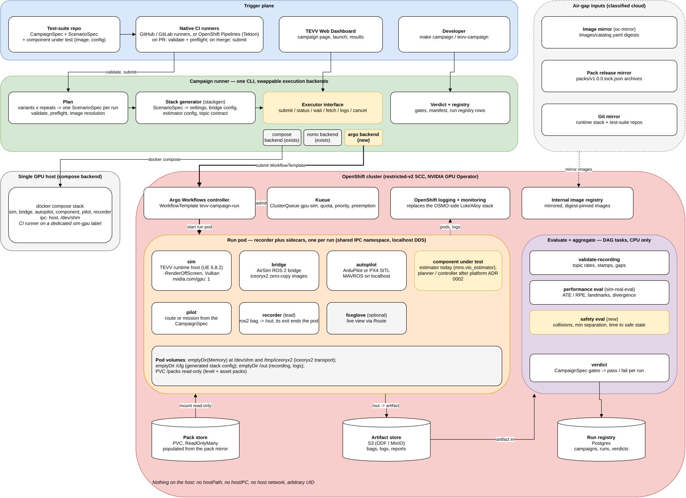
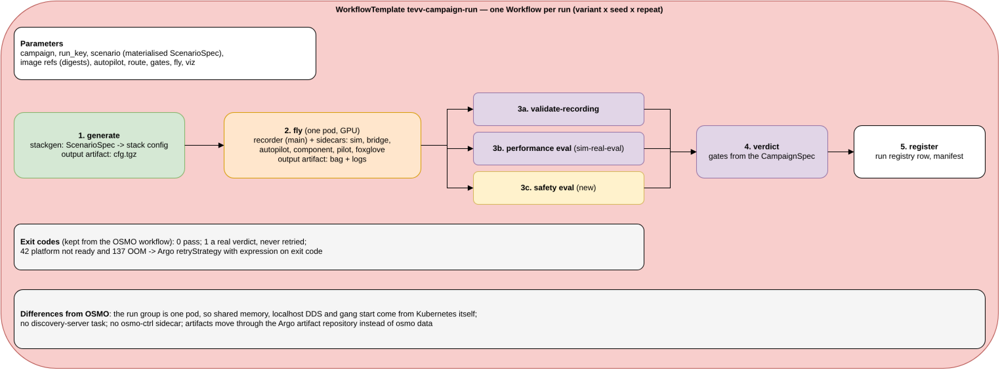

# Design: campaigns on OpenShift with Argo Workflows — one campaign runner, three backends

Decisions taken while building it, and where they depart from this doc: [decision log](2026-09-30-argo-migration-decisions.md).

Status: **proposal** for the M-S-Simulation-Runtime-Stack and MnS-Integration-Platform
owners, and for DSTA's platform discussion. Date: 30 Sept 2026.

Diagrams: [`diagrams/campaigns-openshift-argo.drawio`](diagrams/campaigns-openshift-argo.drawio)
(two pages: system architecture, run workflow). The PNGs below are exported from it.

## 1. Why

DSTA's three questions for simulation are sim-to-real credibility, which platform should run
it, and moving it into classified clouds. The main use of the platform is **evaluating
autonomy stacks and their components**: run a component against a matrix of conditions,
record the evidence, and score it.

Today that runs two ways:

- **Compose on one GPU host** (`make campaign`). As of #106 this flies and records a run end to
  end on the v1.0.0 images.
- **OSMO** (`osmo/campaign.py`) on a kind cluster. It works, but costs a Kubernetes cluster, the
  OSMO control plane, and a separate Loki/Alloy logging stack. OSMO's own workflow logs kept 966
  of 7,675 lines in one run. It also forces the simulator's image transport onto RPC (§3).

Neither is a natural fit for an accredited OpenShift estate. The question here is how much
carries over to OpenShift if the OSMO layer is replaced with Argo Workflows.

**Goal.** One campaign runner with swappable execution backends — compose (a single GPU host or
a CI runner), OSMO (existing), and Argo (new, on OpenShift). The same CampaignSpec runs
unchanged on each, and test suites are onboarded through CI.

**Non-goals.**
- Replacing compose. It stays the way to run on one GPU host, including CI runners.
- Removing the OSMO backend. It stays until the Argo backend covers what it does.
- Multi-tenant authentication. That belongs to the dashboard's own design.

## 2. Decision summary

| Question | Proposal | Why |
| --- | --- | --- |
| Workflow engine on the cluster | Argo Workflows | Several containers in one pod (a main container with sidecars), a DAG with artifacts, and it runs on stock Kubernetes and OpenShift |
| What a run is | One Argo Workflow: generate, then fly (one pod), then evaluate, then verdict | Keeps the OSMO workflow's three phases and exit-code contract |
| The fly step | One pod, all real-time containers in it | Shared IPC namespace, so iceoryx2 zero-copy works, DDS runs over localhost, and every container starts and stops together |
| Queueing and GPU quota | Kueue `ClusterQueue gpu-sim` | Priority and preemption across teams, without OSMO pools |
| Where CI fits | Native runners (GitHub, GitLab, or OpenShift Pipelines) validate on PR and submit on merge | The same job definition moves into a classified CI system |
| Scale-down path | The compose backend on a dedicated `sim-gpu` runner | No cluster needed for a few campaigns a day |

## 3. What exists and what carries over

| Piece | Today | On Argo / OpenShift |
| --- | --- | --- |
| ScenarioSpec, CampaignSpec, variants and repeats | Portable | Unchanged |
| Stack generator (stackgen) | Container image | Unchanged; it runs as the `generate` step |
| Images: runtime host, bridge, ArduPilot/PX4, estimator, sim-real-eval | Pinned in `images/catalog.yaml` | Unchanged, after the hardening in §6.1 |
| Task scripts `osmo/files/*.sh`, `record.py`, `validate_recording.py`, `verdict.py`, `spawn_check.py` | OSMO task entry scripts | Reused. OSMO's `{{host:task}}` lookups become `localhost` inside the pod |
| `osmo/campaign.py` (1,494 lines) | OSMO executor | About a third is OSMO-specific: the `osmo` CLI, kind-node image checks, the NodePort viewer. That third goes behind the executor interface (§5); the rest — materialise, image resolution, verdict, registry, manifest — is shared |
| `osmo/sim-bridge-vio.workflow.yaml` | OSMO groups run → evaluate → aggregate | Becomes the `tevv-campaign-run` WorkflowTemplate (§4.2) |
| kind cluster config, `osmo/observability/` | Needed for OSMO | Dropped; OpenShift logging and monitoring replace them |
| Discovery-server task | Needed because OSMO pods have no multicast | Dropped; the fly pod uses localhost DDS |

**Transport.** iceoryx2 zero-copy needs the simulator and bridge in the same IPC namespace
([osmo-mapping.md §3.1](../osmo-mapping.md)). OSMO runs each task as its own pod, so the
OSMO path runs on `TRANSPORT=rpc`. Containers in one Kubernetes pod share an IPC namespace, so
the Argo fly pod brings shared memory back, with `emptyDir` (medium `Memory`) volumes at
`/dev/shm` and `/tmp/iceoryx2`.

## 4. Architecture



### 4.1 Planes

- **Trigger plane.** A test-suite repo, native CI runners, the TEVV Web Dashboard and the
  developer CLI. Each of them calls the campaign runner; none of them talks to Argo directly.
- **Campaign runner.** Plans the matrix (variants × repeats → one ScenarioSpec per run),
  runs preflight, generates each stack, hands runs to an executor backend, and applies the
  CampaignSpec gates to the results.
- **Cluster.** The Argo controller, Kueue, the internal image registry, and OpenShift's own
  logging and monitoring. A read-only pack-store PVC, an S3 artifact store (ODF or MinIO) and the
  run registry (Postgres) hold the data.
- **Air-gap inputs.** Image, pack-release and git mirrors feed the cluster in a classified
  environment.

### 4.2 One run



| Step | Template | Output |
| --- | --- | --- |
| 1. generate | stackgen image; `ScenarioSpec` parameter in | artifact `cfg.tgz` |
| 2. fly | recorder (main container) with sidecars: sim (GPU), bridge, autopilot, component under test, pilot, foxglove (optional) | artifact: bag + logs |
| 3a. validate-recording | bridge image, `validate_recording.py` | JSON report |
| 3b. performance eval | sim-real-eval image | ATE/RPE, landmarks, divergence |
| 3c. safety eval (new) | sim-real-eval image | collisions, minimum separation, time to a safe state |
| 4. verdict | `verdict.py` against the CampaignSpec gates | pass or fail |
| 5. register | run-registry row, manifest | — |

The recorder is the lead: its exit ends the fly pod, and Argo then stops the sidecars. A
`containerSet` would not do this, since it ends only when every container has exited. The
OSMO exit codes are kept: `0` pass;
`1` a real verdict, never retried; `42` platform not ready and `137` out of memory, both
retried through an Argo `retryStrategy` expression on the exit code.

## 5. Campaign runner backends

One interface, in the platform's campaign runner, that `make campaign`, `osmo/campaign.py` and
the dashboard all call:

| Operation | compose | osmo | argo |
| --- | --- | --- | --- |
| `submit(run)` | `run_experiment.py` on the host | `osmo workflow submit` | `argo submit --from workflowtemplate/tevv-campaign-run` |
| `status` / `wait` | process exit | `osmo workflow query` | `argo get -o json` / `argo wait` |
| `fetch(run)` | files already in `runs/<run>` | `osmo data download` | S3 artifact download |
| `logs(run)` | container logs | Loki | OpenShift logging (Loki operator) |
| `cancel` | stop the stack | `osmo workflow cancel` | `argo stop` |

The CampaignSpec gains `execution.backend` (default `compose`), and the CLI a `--backend`
flag that overrides it. The run manifest records which backend ran each run.

**Where the interface lives first (phase 2).** The Argo backend went in beside the OSMO
one, in the runtime stack's executor (`osmo/campaign.py --backend argo`, with the cluster
calls in `osmo/backends.py`), not in the platform's runner. The platform's runner executes
inside the product-shell container, which has no cluster client, kubeconfig or OSMO
session. That is also why the OSMO executor was written outside it. The two cluster
backends therefore share one executor today: materialise, generate, image checks, verdict,
run registry, manifest. Each backend answers in OSMO's vocabulary, so the registry and the
scorecard need no change. The interface moves into the platform's runner, next to compose,
once the product shell carries a cluster client. `execution.backend` in the CampaignSpec
waits for that move too. Until then the choice is the executor's `--backend` flag (or
`TEVV_CAMPAIGN_BACKEND`). The manifest's `target` and each `run.json` record it.

## 6. What OpenShift demands

### 6.1 Arbitrary-UID, non-root images

The default `restricted-v2` SCC forbids root, host paths, host IPC and host networking, and
assigns a random UID. Every image must run as that UID, with group-0-writable working
directories:

| Image | Known issue |
| --- | --- |
| Runtime host | Runs as `ue4` (uid 1000) and writes under `/tmp`. Check the paths it writes outside `/tmp` |
| ArduPilot | The entrypoint drops privileges from root with gosu; OSMO already had to bypass it |
| PX4 | The service runs as root today |
| Bridge, estimator, eval | Mostly `HOME=/tmp` today; to verify |

This is the largest chunk of work, and it sits in the image repositories.

### 6.2 GPU for rendering

The simulator renders off-screen on Vulkan. The nodes need GPUs with graphics support, and the
NVIDIA GPU Operator must expose graphics capabilities (`NVIDIA_DRIVER_CAPABILITIES=all`, as the
OSMO sim task sets today). Some data-centre compute GPUs lack graphics support or render
poorly; confirm the GPU model in the target cloud first.

### 6.3 Data without host mounts

| Data | Today | On OpenShift |
| --- | --- | --- |
| Level and asset packs (tens of GB) | Bind-mounted from the host pack store | PVC, `ReadOnlyMany`, populated once per pack lock from the pack mirror |
| Generated stack config | Bind mount | Artifact from `generate`, unpacked into `/cfg` |
| Recordings and logs | `runs/<run>` on the host | Argo artifact repository (S3) |
| Campaign and run records | Run registry (Postgres) | Unchanged |

### 6.4 Air gap

Images are mirrored with `oc-mirror`, by the digests in `images/catalog.yaml`. Pack releases
are mirrored from GitHub into an internal store, keyed by `packs/v1.0.0.lock.json`. The
runtime-stack and test-suite repos are mirrored into the internal git service.

### 6.5 Support status

Red Hat ships Argo CD (OpenShift GitOps) and Tekton (OpenShift Pipelines) as products. Argo
Workflows itself is community software, but it is also the engine inside OpenShift AI's Data
Science Pipelines. **To confirm with the accrediting authority:** whether the community Argo
Workflows operator is allowed, or whether runs must go through OpenShift AI. Kueue has a Red Hat
build.

## 7. Onboarding test suites

A test suite is a directory in a suites repo:

```
suites/<name>/
  CampaignSpec.yaml      variants (conditions), repeats, recording, gates, execution.backend
  ScenarioSpec.yaml      world, rig, sensors, component under test
  routes/ config/        routes; the component's configuration and calibration
```

1. **Onboard:** a pull request adds or changes a suite.
2. **Check:** CI runs `campaign validate` and `campaign preflight`. These check the calibration
   against the declared rig, the topics the component needs against those the stack publishes,
   and the routes.
3. **Run:** on merge, CI submits the campaign (Argo backend on the cluster, compose on a
   runner).
4. **Results:** land in the run registry and the dashboard.

**Gap: components other than estimators.** Only estimators plug in today
(`extensions.mns.vio_estimator`). Planners and controllers need the generic component slot,
goals mission and nav-goal that MnS-Integration-Platform's ADR 0002 (component under test) proposes (`mns.components`). That is platform work that
comes before onboarding anything beyond an estimator, whichever backend runs it.

**Safety and performance benchmarks.** A suite declares which it is benchmarking, and the gates
follow:

- **Performance:** ATE/RPE, landmarks, divergence rate.
- **Safety:** event gates — zero collisions, minimum separation from obstacles, time to detect
  estimator failure, time to reach a safe state after a degradation (GNSS loss, camera blackout,
  glare, gusts).

A safety suite needs the sim to reproduce each degradation at least as harshly as reality, not
to be accurate everywhere. No safety evaluator exists yet: step 3c is new work.

## 8. Changes by repository

| Repository | Change |
| --- | --- |
| MnS-Integration-Platform | The executor interface in the campaign runner; the compose and OSMO backends behind it; the Argo backend; `execution.backend` in the CampaignSpec schema (MnS-ScenarioSpec); the safety evaluator in sim-real-eval; the ADR 0002 component slot |
| M-S-Simulation-Runtime-Stack | The `tevv-campaign-run` WorkflowTemplate and Kueue manifests (`argo/`); a local Argo dev cluster; the suites layout and CI template; these docs |
| Image repos (TEVV-Airsim, bridge, ArduPilot, PX4, estimator) | Arbitrary-UID hardening (§6.1) |
| TEVV-Web-Dashboard | Launch and watch through the executor interface instead of the OSMO CLI |

## 9. Delivery and acceptance

| Phase | Deliverable | Accepted when |
| --- | --- | --- |
| 1 | Executor interface; compose and OSMO backends behind it | `make campaign` and `osmo/campaign.py run` behave exactly as before |
| 2 | Argo backend and WorkflowTemplate on a local cluster (kind or k3s with GPU, Argo, Kueue) | One `vio-reference` run flies in a single pod on iceoryx2, and the verdict lands in the registry |
| 3 | Image hardening | The same run passes under `restricted-v2` on OpenShift Local or a GPU OpenShift node |
| 4 | Pack-store PVC and S3 artifacts | No host path anywhere in the WorkflowTemplate |
| 5 | Suites repo and CI onboarding; the platform ADR 0002 component slot | A new suite goes from pull request to verdict without manual steps |
| 6 | Air-gap bundle | An install from the mirrors alone, on an isolated cluster |

## 10. Risks and open questions

- **GPU model and rendering** in the target cloud (§6.2). This blocks everything, so check it
  first.
- **Argo Workflows support status** (§6.5).
- **Pod size.** The OSMO run group requests about 21 of the GPU node's 24 cores, sidecars
  included. As one pod, the fly step needs a node with that much free, since a pod cannot be
  split across nodes.
- **Shared-memory transport in one pod** is measured on the phase 2 prototype (`argo/README.md`):
  iceoryx2 connects between the sim and bridge containers, the fisheye cameras run at
  10.6–29 Hz against 12–29 Hz on compose, and a flight with OpenVINS live scored 0.63 m
  ATE. Every container must run as one user and mount the same `/dev/shm`.
- **Estimator results that moved without a code change.** An interleaved benchmark
  (`argo/README.md`) found stereo OpenVINS diverging on OSMO and Argo alike today. The
  same images and config scored 0.45–0.9 m on 25 Sep. Argo itself was 14 % faster per run
  (170 against 198 s) at the same GPU load. A campaign's scores are only comparable within
  one sitting until the cause is found, whichever backend runs it.
- **Live viewing.** Foxglove through an OpenShift Route needs websocket support on the router.
  Phase 2 checks it.
- **Measurement noise on shared hosts.** During one measured flight, CI builds used 5–17 of 24
  cores next to the simulator. On the cluster, Kueue quotas and dedicated sim nodes keep
  campaigns off build workloads; on a runner, use a dedicated `sim-gpu` label.
