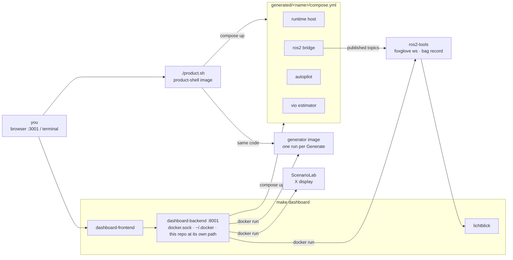
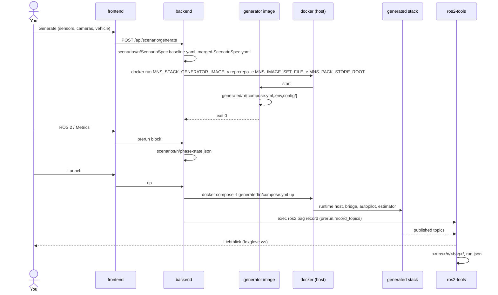
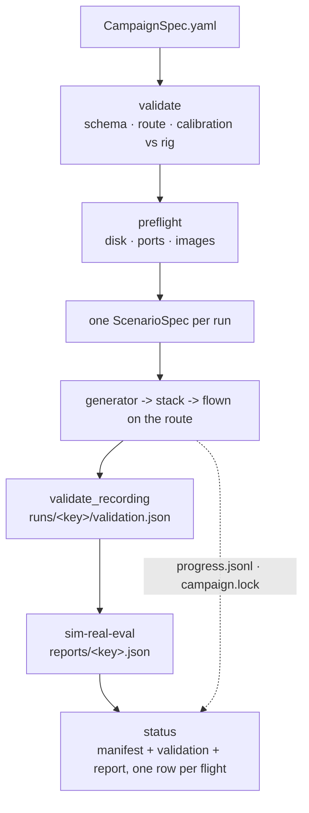

# How it fits together

What you do, what lands on disk because of it, and which service acts on that
file next. Read this before any other page under `docs/`: the others each go
deep on one box here.

This page is about the **generated** path -- a ScenarioSpec turned into a
stack by the platform's generator image, which is the only path this
repository ships.

## The actors

| Actor | What it is | Started by |
| --- | --- | --- |
| **You** | a browser on `http://localhost:3001`, or a terminal in this repository | -- |
| **dashboard-backend** | FastAPI, `http://localhost:8001`. The only thing in the loop that both listens to you and can run docker. Runs in *distribution mode*: no platform checkout, no platform Python. | `make dashboard` (`docker-compose-dashboard.yml`) |
| **dashboard-frontend**, **dashboard-lichtblick** | the UI and the topic viewer | `make dashboard` |
| **product shell** | the platform's launcher, baked into `MNS_PRODUCT_SHELL_IMAGE`. Same code the dashboard reaches through the generator image and `tevv-campaign`; a second front door without a browser. | `./product.sh` |
| **generator** | `MNS_STACK_GENERATOR_IMAGE`, run once per Generate. Reads a ScenarioSpec, writes a stack directory, exits. | the backend, or `./product.sh cli` |
| **ScenarioLab** | the Unreal editor, `MNS_AUTHORING_IMAGE`, on your X display | the backend's Author phase |
| **a generated stack** | runtime host (Unreal + AirSim), ROS 2 bridge, autopilot SITL, optional VIO estimator and sim-real-eval worker -- `generated/<name>/compose.yml` | the backend's Launch, or `./product.sh cli` |
| **ros2-tools** | one container from the bridge image, outside any compose project. Foxglove websocket for Lichtblick; bag recording execs into it. | the backend, when the bridge image changes |



The backend's four mounts are the whole contract between the dashboard and
this repository:

| Mount | Why |
| --- | --- |
| `/var/run/docker.sock` | it drives docker: runs the generator, `compose up`s stacks, creates `ros2-tools` |
| `${DOCKER_CONFIG:-$HOME/.docker}` at `/root/.docker`, read-only | a pull uses **this container's** credentials, not your shell's ([details](dashboard-images.md#6-credentials-the-socket-alone-is-not-enough)) |
| `${MSRS_ROOT:-$PWD}` at the **identical** host path | every path the backend writes is valid for the generator container and for compose on the host, unchanged |
| `${TEVV_RUNS_DIR:-./runs}` (in this checkout) at `/data/runs` | bags, `run.json`, validation reports, sim-real-eval reports |

## What lands on disk

Every phase leaves a file, and the next actor reads that file rather than
asking the previous one. That is why a scenario reused later unlocks its
phases without redoing them: phase completion is computed from what exists.

| Path | Written by | Read by |
| --- | --- | --- |
| `images/catalog.yaml` | you (`tools/images.sh bump`, or by hand) | `tools/images.sh sync` -- and nothing else, directly |
| `images/*.generated.env`, `images/image-set*.generated.yaml`, `product-images.env` | `tools/images.sh sync`; committed | `make dashboard` (env files), the generator (`MNS_IMAGE_SET_FILE`) |
| `packs/*.lock.json` | the release | `tools/install-demo-packs.sh` |
| `.mns/<channel>/pack-store/` | `./download-packs.sh` (or `make dashboard MNS_DEMO_PACKS=...`) -> the product-shell image's installer | the generator, ScenarioLab (staged copy), the runtime host |
| `.mns/<channel>/authoring-data/ResolvedPacks/` | `tools/stage-authoring-packs.sh` | ScenarioLab |
| `scenarios/<name>/ScenarioSpec.yaml` (+ `includes:` files) | ScenarioLab export, or the Generate form; `tevv-campaign init` | the generator; `CampaignSpec.scenario` |
| `scenarios/<name>/ScenarioSpec.baseline.yaml` | the backend, a snapshot of the authored spec before the form's sensor edits | the backend, to show what the form changed |
| `scenarios/<name>/phase-state.json` | the backend: the `prerun` block (ROS 2 and Metrics phases) and the Author-skip flag | the backend's Launch |
| `scenarios/<name>/CampaignSpec.yaml`, `routes/*.yaml` | you, from `scenarios/vio-reference/` or `tevv-campaign init` | `tevv-campaign` |
| `generated/<name>/compose.yml`, `.env` | the generator; gitignored | `docker compose up` -- by the backend or the product shell |
| `generated/<name>/config/topic_names.yaml`, `config/sim2real/topics.yaml`, `config/vio/` | the generator | the bridge, the estimator, the recorder, sim-real-eval. **The only place topic names may be read from.** |
| `<runs>/<name>/<bag>/`, `<runs>/<name>/run.json` | `ros2-tools`, driven by the backend's recorder | Analysis, sim-real-eval, the integration bundle |
| `<runs>/<name>/validation.json` | `validate_recording` (a campaign step, or `make validate`) | the integration bundle, `tevv-campaign status` |
| `<runs>/_reports/*.json` | `sim-real-eval` | the Analysis phase, `tevv-campaign status` |
| `<campaigns>/<id>/manifest.json`, `progress.jsonl`, `campaign.lock` | `tevv-campaign run` | `tevv-campaign status|watch|cancel`, `/api/campaign/jobs/*` |

## The phases, one at a time

The dashboard's stepper is the order things have to happen in. Each row: what
you do, which endpoint the frontend calls, what appears on disk, which actor
does the work.

| Step | You | Endpoint | On disk afterwards | Who acts |
| --- | --- | --- | --- | --- |
| **0 Content** | pick the engine line; install missing level and object packs | `/api/content` | `.mns/<channel>/pack-store/`, `authoring-data/` | backend runs the product-shell image's installer |
| **1a Author** | open ScenarioLab, build the world, export | `/api/scenario/editor`, `/api/product-shell` | `scenarios/<name>/ScenarioSpec.yaml` | ScenarioLab on your display |
| **1b Generate** | sensors, cameras, vehicle in the form; Generate | `POST /api/scenario/generate` | `ScenarioSpec.baseline.yaml`; the merged spec; `generated/<name>/` | backend writes the spec, runs the **generator** once |
| **1c ROS 2** | domain id, namespace, which topics a bag records, autostart | saved into `phase-state.json` `prerun` | `scenarios/<name>/phase-state.json` | backend |
| **1d Metrics** | what the sim logs | same block | same file | backend |
| **2 Launch** | Up | `/api/scenario` lifecycle | containers from `generated/<name>/compose.yml`; a bag under `<runs>/` if autostart | backend: `compose up`, then the recorder execs into `ros2-tools` |
| **3 Runtime** | arm, take off, hover; tune sensors live; teleop; watch topics | `/api/flight-controls`, `/api/sensor-controls`, `/api/teleop`, `/api/run-state`, `/api/stacks` | `settings.json` edits for hot sensor tuning; `/run_state` published | backend to the autopilot and AirSim; Lichtblick from `ros2-tools` |
| **4 Analysis** | run a Sim2Real evaluation; read VIO results; export telemetry; download the integration bundle | `/api/sim2real`, `/api/vio-stress`, `/api/telemetry`, `/api/exports` | `<runs>/_reports/`; CSV/Parquet exports | backend shells out to `sim-real-eval`; reads `metric_results` |

Two rules make the table work:

1. **The backend never imports platform code.** It reaches the platform three
   ways only: run the generator image, `compose up` what the generator wrote,
   or exec a CLI (`sim-real-eval`, `tevv-campaign`) whose `--json` output is
   the API. The contracts package is not in the backend image either, so
   spec rules are validated by the generator, not the form.
2. **The backend never starts a stack image itself.** The generator writes the
   pins into `generated/<name>/.env`; compose pulls. Which pins, and why a
   generated stack re-pulls or does not, is
   [How the dashboard gets its images](dashboard-images.md).



## Without the browser: the same loop from a terminal

```bash
./product.sh setup                   # exact pins pulled, packs installed
./product.sh doctor                  # every channel ref present?
./product.sh cli runtime scenarios/<name>      # generate + up one stack
./product.sh start                   # the launcher's own HTTP UI on :8760
```

`product.sh` runs the product-shell image with this repository mounted at its
own path -- the same mount rule the backend uses -- so `scenarios/` and
`generated/` are shared between the two front doors. A stack generated from
the dashboard shows up in the shell, and the other way round.

## Campaigns: the loop, N times, scored

A campaign is the experiment *over* a scenario: the same stack flown once per
variant and repeat with one thing different each time, every flight recorded,
gated and scored. The generator never sees a CampaignSpec -- each run is
materialised into a complete ScenarioSpec first, so any single run reproduces
on its own.

```
scenarios/vio-reference/
  ScenarioSpec.yaml        the world and the rig
  CampaignSpec.yaml        variants x repeats, the route, retention, scoring
  routes/reference-flight.yaml
  openvins/                the estimator's calibration
```

```bash
make campaign                                  # the reference campaign, end to end
make campaign CAMPAIGN=my-test                 # yours
make campaign ARGS="validate vio-reference"    # shape, route, calibration vs rig; touches nothing
make campaign ARGS="preflight vio-reference"   # + disk, ports, images
make campaign-status CAMPAIGN=vio-reference    # one row per flight
```

`make campaign` is `./product.sh cli campaign ...`, so it is `tevv-campaign`
inside the product-shell image, against `scenarios/` here. Start your own with
`make campaign ARGS="init my-test"`, which scaffolds from the reference.



The dashboard's `/api/campaign/*` endpoints shell out to the same
`tevv-campaign` binary (`TEVV_CAMPAIGN_BIN`) and return its `--json`. A
campaign holds the GPU, the simulator ports and the X display for hours, so
one runs at a time: the lock file refuses a second, and `cancel` is
cooperative -- the current flight is torn down cleanly and its bundle written.

## Where each part is documented

| Part | Page |
| --- | --- |
| this page: the loop, the files, the actors | you are here |
| the image catalog, channels, `sync`/`verify`/`bump` | [Changing a container image](images.md) |
| `make dashboard` step by step, `IMAGE_MODE`, precedence, the credentials mount, the pull-policy override, `ros2-tools` | [How the dashboard gets its images](dashboard-images.md) |
| why one catalog | [ADR 0002](adr/0002-one-image-catalog.md) |
| channels, the pack store, locks, installing and removing packs | [packs/README.md](../packs/README.md) |
| `product.sh` and the headless CLI | [The product shell from a terminal](cli.md) |
| which topics a generated stack publishes | [What will this stack publish?](topics.md) |
| running campaigns | [Campaigns](campaigns.md) |
| the reference campaign itself | [`scenarios/vio-reference/README.md`](../scenarios/vio-reference/README.md) |
| the whole product across repositories, and the platform's internals | TEVV-Airsim docs, *Architecture -> TEVV Platform Map*; MnS-Integration-Platform `docs/running-a-campaign.md`, `docs/topic-and-frame-contracts.md` |
| the compose file's own statement of the mounts and precedence | the header comment of `docker-compose-dashboard.yml` |
