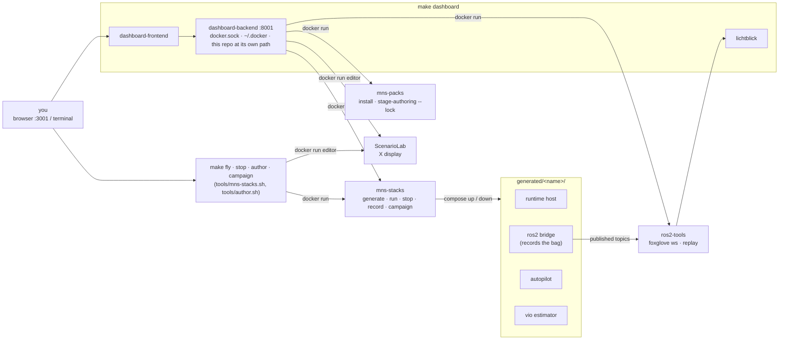
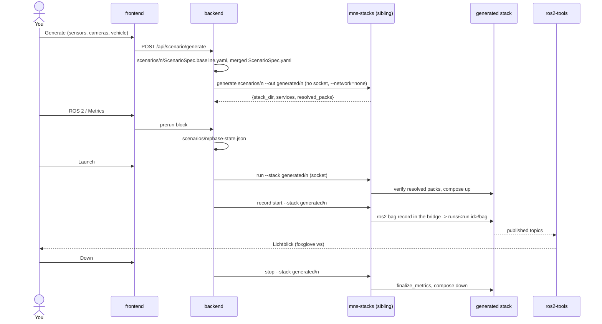
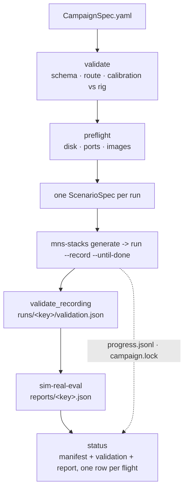

# How it fits together

What you do, what lands on disk because of it, and which service acts on that
file next. Read this before any other page under `docs/`: the others each go
deep on one box here.

This page is about the **generated** path -- a ScenarioSpec turned into a
stack by `mns-stacks generate`, which is the only path this repository ships.
Nothing here runs from source: every box is an image pinned in
`images/catalog.yaml`, and every pack a version pinned in
`packs/v1.0.0.lock.json`.

## The actors

| Actor | What it is | Started by |
| --- | --- | --- |
| **You** | a browser on `http://localhost:3001`, or a terminal in this repository | -- |
| **dashboard-backend** | FastAPI, `http://localhost:8001`. The only thing in the loop that both listens to you and can run docker. Runs in *distribution mode*: no platform checkout, no platform Python. | `make dashboard` (`docker-compose-dashboard.yml`) |
| **dashboard-frontend**, **dashboard-lichtblick** | the UI and the topic viewer | `make dashboard` |
| **mns-stacks** | `MNS_STACKS_IMAGE` (MnS-Integration-Platform `platform/stacks`): `generate` a stack from a ScenarioSpec (no Docker socket), then `run`/`stop`/`status`/`logs`, `record start/stop`, `campaign ...` (with the socket). One command per call; it exits. | the backend, or `make fly`/`stop`/`campaign`/`stacks` through `tools/mns-stacks.sh` |
| **mns-packs** | `MNS_PACKS_IMAGE` (TEVV-Content-Pack-SDK): `install` a pack into the store, `stage-authoring --lock` it for ScenarioLab, `verify`, `status` | `tools/install-demo-packs.sh`, `tools/stage-authoring-packs.sh` (behind `./download-packs.sh`, `make dashboard` and the Content phase) |
| **ScenarioLab** | the Unreal editor, `MNS_AUTHORING_IMAGE`, on your X display | the backend's Author phase, or `make author` (the same `docker run`) |
| **a generated stack** | runtime host (Unreal + AirSim), ROS 2 bridge, autopilot SITL, optional VIO estimator and sim-real-eval worker -- `generated/<name>/` | `mns-stacks run` |
| **ros2-tools** | one container from the bridge image, outside any compose project. Foxglove websocket for Lichtblick, and bag replay. | the backend, when the bridge image changes |


```mermaid
flowchart LR
  YOU["you<br/>browser :3001 / terminal"]
  subgraph DASH["make dashboard"]
    FE["dashboard-frontend"]
    BE["dashboard-backend :8001<br/>docker.sock · ~/.docker · this repo at its own path"]
    LB["lichtblick"]
  end
  MK["make fly · stop · author · campaign<br/>(tools/mns-stacks.sh, tools/author.sh)"]
  STK["mns-stacks<br/>generate · run · stop · record · campaign"]
  PK["mns-packs<br/>install · stage-authoring --lock"]
  SL["ScenarioLab<br/>X display"]
  subgraph STACK["generated/&lt;name&gt;/"]
    RH["runtime host"]
    BR["ros2 bridge<br/>(records the bag)"]
    AP["autopilot"]
    VIO["vio estimator"]
  end
  RT["ros2-tools<br/>foxglove ws · replay"]
  YOU --> FE --> BE
  YOU --> MK
  BE -- "docker run" --> STK
  BE -- "docker run" --> PK
  BE -- "docker run editor" --> SL
  MK -- "docker run" --> STK
  MK -- "docker run editor" --> SL
  STK -- "compose up / down" --> STACK
  BE -- "docker run" --> RT
  BR -- "published topics" --> RT --> LB
```

The backend's four mounts are the whole contract between the dashboard and
this repository:

| Mount | Why |
| --- | --- |
| `/var/run/docker.sock` | it drives docker: runs mns-stacks, mns-packs and ScenarioLab, creates `ros2-tools` |
| `${DOCKER_CONFIG:-$HOME/.docker}` at `/root/.docker`, read-only | a pull uses **this container's** credentials, not your shell's ([details](dashboard-images.md#6-credentials-the-socket-alone-is-not-enough)) |
| `${MSRS_ROOT:-$PWD}` at the **identical** host path | every path the backend hands mns-stacks is a host path, valid for Compose on the host, unchanged |
| `${TEVV_RUNS_DIR:-./runs}` (in this checkout) at `/data/runs` | bags, `run.json`, validation reports, sim-real-eval reports. Its host path also arrives as `TEVV_RUNS_DIR` (the same expression as the mount source), which the backend hands to mns-stacks |

The headless targets follow the same rule: `tools/mns-stacks.sh` mounts this
checkout and the runs directory at their host paths, and the Docker socket
only for the commands that drive containers. See [Headless](stacks.md).

## What lands on disk

Every phase leaves a file, and the next actor reads that file rather than
asking the previous one. That is why a scenario reused later unlocks its
phases without redoing them: phase completion is computed from what exists.

| Path | Written by | Read by |
| --- | --- | --- |
| `images/catalog.yaml` | you (`tools/images.sh bump`, or by hand) | `tools/images.sh sync` -- and nothing else, directly |
| `images/*.generated.env`, `images/image-set*.generated.yaml` | `tools/images.sh sync`; committed | `make` (env files), mns-stacks (`MNS_IMAGE_SET_FILE`) |
| `packs/*.lock.json` | the release (`make pack-lock`) | `tools/install-demo-packs.sh`, `mns-packs stage-authoring --lock` |
| `.mns/<channel>/pack-store/` | `./download-packs.sh` (or the Content phase) -> `mns-packs install` | mns-stacks, ScenarioLab (staged copy), the runtime host |
| `.mns/<channel>/authoring-data/ResolvedPacks/` | `tools/stage-authoring-packs.sh` -> `mns-packs stage-authoring --lock` | ScenarioLab |
| `scenarios/<name>/ScenarioSpec.yaml` (+ `includes:` files) | ScenarioLab export, or the Generate form; `mns-stacks campaign init` | `mns-stacks generate`; `CampaignSpec.scenario` |
| `scenarios/<name>/ScenarioSpec.baseline.yaml` | the backend, a snapshot of the authored spec before the form's sensor edits | the backend, to show what the form changed |
| `scenarios/<name>/phase-state.json` | the backend: the `prerun` block (ROS 2 and Metrics phases) and the Author-skip flag | the backend's Launch |
| `scenarios/<name>/CampaignSpec.yaml`, `routes/*.yaml` | you, from `scenarios/vio-reference/` or `mns-stacks campaign init` | `mns-stacks campaign` |
| `generated/<name>/` (compose file, `.env`, `config/`) | `mns-stacks generate`; gitignored | `mns-stacks run/stop/status` |
| `generated/<name>/config/topic_names.yaml`, `config/sim2real/topics.yaml`, `config/vio/` | `mns-stacks generate` | the bridge, the estimator, the recorder, sim-real-eval. **The only place topic names may be read from.** |
| `<runs>/<run id>/bag/`, `<runs>/<run id>/run.json` | `mns-stacks record` / `run --record` (the bridge container records) | Analysis, replay, sim-real-eval, the integration bundle |
| `<runs>/<name>/validation.json` | `validate_recording` (a campaign step) | the integration bundle, `mns-stacks campaign status` |
| `<runs>/_reports/*.json` | `sim-real-eval` | the Analysis phase, `mns-stacks campaign status` |
| `<campaigns>/<id>/campaign_manifest.json`, `progress.jsonl`, `campaign.lock` | `mns-stacks campaign run` | `campaign status|watch|cancel`, `/api/campaign/jobs/*` |

## The phases, one at a time

The dashboard's stepper is the order things have to happen in. Each row: what
you do, what appears on disk, which actor does the work.

| Step | You | On disk afterwards | Who acts |
| --- | --- | --- | --- |
| **0 Content** | pick the engine line; install missing level and object packs | `.mns/<channel>/pack-store/`, `authoring-data/` | the backend runs `tools/install-demo-packs.sh` (mns-packs) |
| **1a Author** | open ScenarioLab, build the world, export | `scenarios/<name>/ScenarioSpec.yaml` | ScenarioLab on your display |
| **1b Generate** | sensors, cameras, vehicle in the form; Generate | `ScenarioSpec.baseline.yaml`; the merged spec; `generated/<name>/` | the backend writes the spec, runs `mns-stacks generate` once |
| **1c ROS 2** | domain id, namespace, which topics a bag records, autostart | `scenarios/<name>/phase-state.json` | backend |
| **1d Metrics** | what the sim logs | same file | backend |
| **2 Launch** | Up | the stack's containers; a bag under `<runs>/` if autostart | `mns-stacks run` (it verifies the stack's resolved packs first), then `mns-stacks record start` |
| **3 Runtime** | arm, take off, hover; tune sensors live; teleop; watch topics | `settings.json` edits for hot sensor tuning; `/run_state` published | backend to the autopilot and AirSim; Lichtblick from `ros2-tools` |
| **4 Analysis** | run a Sim2Real evaluation; read VIO results; export telemetry; download the integration bundle | `<runs>/_reports/`; CSV/Parquet exports | backend shells out to `sim-real-eval`; reads `metric_results` |
| **Down** | Down | the stack's final metrics under `<runs>/` | `mns-stacks stop` (always `finalize_metrics` first) |

Two rules make the table work:

1. **The backend never imports platform or SDK code.** It reaches them by
   running their images: `mns-stacks` and `mns-packs` with `--json` (the
   `mns.stacks_cli.v1` / `mns.packs_cli.v1` envelopes are the API) and
   `sim-real-eval`. Spec rules are validated by `mns-stacks`, not the form.
2. **The backend never starts a stack image itself.** `mns-stacks generate`
   writes the pins into `generated/<name>/.env`; `mns-stacks run` brings them
   up. Which pins, and why a generated stack re-pulls or does not, is
   [How the dashboard gets its images](dashboard-images.md).


```mermaid
sequenceDiagram
  actor You
  participant FE as frontend
  participant BE as backend
  participant MS as mns-stacks (sibling)
  participant ST as generated stack
  participant RT as ros2-tools
  You->>FE: Generate (sensors, cameras, vehicle)
  FE->>BE: POST /api/scenario/generate
  BE->>BE: scenarios/n/ScenarioSpec.baseline.yaml, merged ScenarioSpec.yaml
  BE->>MS: generate scenarios/n --out generated/n (no socket, --network=none)
  MS-->>BE: {stack_dir, services, resolved_packs}
  You->>FE: ROS 2 / Metrics
  FE->>BE: prerun block
  BE->>BE: scenarios/n/phase-state.json
  You->>FE: Launch
  BE->>MS: run --stack generated/n (socket)
  MS->>ST: verify resolved packs, compose up
  BE->>MS: record start --stack generated/n
  MS->>ST: ros2 bag record in the bridge -> runs/<run id>/bag
  ST-->>RT: published topics
  RT-->>You: Lichtblick (foxglove ws)
  You->>FE: Down
  BE->>MS: stop --stack generated/n
  MS->>ST: finalize_metrics, compose down
```

## Without the browser: the same loop from a terminal

```bash
make doctor                                   # Docker, Compose, every pinned image present?
make author                                   # ScenarioLab, as the dashboard opens it
make fly SCENARIO=<name> RECORD=1             # generate, fly until done, stop; bag in runs/
make stop                                     # if a fly was interrupted
make stacks ARGS="status --stack generated/<name> --json"
```

The targets run the same images with the same mounts as the dashboard, so
`scenarios/`, `generated/` and the runs directory are shared between the two:
a stack generated from the dashboard can be stopped from a terminal, and a
headless bag replays in the dashboard. Details: [Headless](stacks.md).

## Campaigns: the loop, N times, scored

A campaign is the experiment *over* a scenario: the same stack flown once per
variant and repeat with one thing different each time, every flight recorded,
gated and scored. `mns-stacks generate` never sees a CampaignSpec -- each run
is materialised into a complete ScenarioSpec first, so any single run
reproduces on its own.

```
scenarios/vio-reference/
  ScenarioSpec.yaml        the world and the rig
  CampaignSpec.yaml        variants x repeats, the route, retention, scoring
  routes/reference-flight.yaml
  openvins/                the estimator's calibration
```

```bash
make campaign                                  # the reference campaign, end to end
make campaign CAMPAIGN=my-test                 # yours
make campaign ARGS="validate vio-reference"    # shape, route, calibration vs rig; touches nothing
make campaign ARGS="preflight vio-reference"   # + disk, ports, images
make campaign-status CAMPAIGN=vio-reference    # one row per flight
```

`make campaign` is `mns-stacks campaign ...` from the pinned image, against
`scenarios/` here. Start your own with `make campaign ARGS="init my-test"`,
which scaffolds from the reference.


```mermaid
flowchart TD
  A["CampaignSpec.yaml"] --> B["validate<br/>schema · route · calibration vs rig"]
  B --> C["preflight<br/>disk · ports · images"]
  C --> D["one ScenarioSpec per run"]
  D --> E["mns-stacks generate -> run --record --until-done"]
  E --> F["validate_recording<br/>runs/&lt;key&gt;/validation.json"]
  F --> G["sim-real-eval<br/>reports/&lt;key&gt;.json"]
  G --> H["status<br/>manifest + validation + report, one row per flight"]
  E -. "progress.jsonl · campaign.lock" .-> H
```

The dashboard's `/api/campaign/*` endpoints run the same `mns-stacks
campaign ... --json`. A campaign holds the GPU, the simulator ports and the X
display for hours, so one runs at a time: the lock file refuses a second, and
`cancel` is cooperative -- the current flight is torn down cleanly and its
bundle written.

## Where each part is documented

| Part | Page |
| --- | --- |
| this page: the loop, the files, the actors | you are here |
| `make fly`, `make author`, `make campaign`, `make stacks`, `make doctor` | [Headless](stacks.md) |
| the image catalog, channels, `sync`/`verify`/`bump`, pending digests, the host pin | [Changing a container image](images.md) |
| `make dashboard` step by step, `IMAGE_MODE`, precedence, the credentials mount, the pull-policy override, `ros2-tools` | [How the dashboard gets its images](dashboard-images.md) |
| why one catalog | [ADR 0002](adr/0002-one-image-catalog.md) |
| channels, the pack store, locks, installing and removing packs | [packs/README.md](../packs/README.md) |
| which topics a generated stack publishes | [What will this stack publish?](topics.md) |
| running campaigns | [Campaigns](campaigns.md) |
| the reference campaign itself | [`scenarios/vio-reference/README.md`](../scenarios/vio-reference/README.md) |
| the v1.0.0 architecture across repositories: who owns what | MnS-Integration-Platform `docs/v1.0.0-architecture.md` |
| the compose file's own statement of the mounts and precedence | the header comment of `docker-compose-dashboard.yml` |
