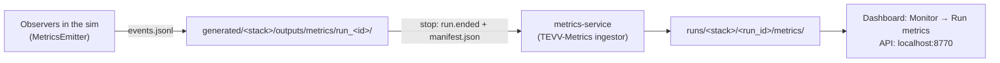

# Metrics: where everything is

Every simulation run is measured the same way, whether you start it from the
dashboard, from `./product.sh cli`, or as part of a campaign:



1. **Observers** inside the simulator record what happens.
2. **Stopping** the stack closes the run and writes its manifest.
3. The **metrics service** scores each finished run once.
4. You read the results in the **dashboard**, the **API**, or the **files**.

## 1. Observers: what the simulator records

The runtime host carries the MetricsEmitter plugin. Its observers attach to
the scenario automatically and write one event log per run.

| Observer | Records | Default |
|---|---|---|
| Actor state sampler | Ground-truth pose and velocity of every vehicle and moving actor (`vehicle.pose.gt`) | on |
| Collision | Every contact, with impact speed and the other object (`collision.detected`) | on |
| Near miss | Close approaches below a distance threshold (`near_miss.detected`) | off |
| Obstacle clearance | Distance from the vehicle to the nearest obstacle | off |
| Distance to target | Distance to the scenario's goal; `goal.reached` when it is reached | off |
| Sensor health | Expected against observed sensor rates (`sensor.health`) | off |
| Autopilot and estimator | Mode, arming, GPS and the autopilot's own position estimate (`estimator.local_position`) | on |
| Scenario lifecycle | `run.started`, `scenario.started`, `scenario.ready`, phase changes, `run.ended` | on |

**Choosing observers.**
- **Dashboard:** step 1d (Metrics) of the scenario wizard.
- **ScenarioSpec:** list the detectors to turn on in the scenario's `metrics` block. The generator turns that list into the simulator launch settings (`MNS_METRICS_ARGS` in the stack's `.env`), so CLI and campaign runs get the same detectors as the dashboard.

```yaml
# ScenarioSpec.yaml
runtime:
  metrics:
    enabled: true
    requested: [near_miss, obstacle_clearance, distance_to_target]
```

**Where the log is.** `generated/<stack>/outputs/metrics/run_<id>/events.jsonl`, one JSON event per line (schema 2.x). The stack's `config/metrics/metrics_runtime.json` records what was requested for that stack.

## 2. Closing a run

When the stack stops, the simulator is given up to 60 seconds to shut down
cleanly. That writes the final `run.ended` event. The finalize step then adds
`manifest.json` (run outcome, event counts, entities, timing, provenance) and a
copy of the scenario and stack configuration to the run folder. Stopping from
the dashboard and `./product.sh cli stop --stack ...` do the same.

A run without `run.ended` was cut short, for example by `docker compose down`
run by hand or by a crash. It is still scored, but marked `completed: false`.

## 3. Scoring: the metrics service

`metrics-service` starts with the dashboard (`make dashboard`). It watches
`generated/*/outputs/metrics/` and scores each run once it has finished: the
run has ended, or has a manifest, or has written no events for two minutes. It
uses the TEVV-Metrics ingestor. A run is scored again only if its event log
changes.

| Metric | Meaning |
|---|---|
| Path length, travel time, average speed | Per controlled vehicle, from ground truth; moving obstacles are not counted |
| Acceleration, jerk, curvature | Smoothness of the flown path |
| Collisions | Count, episodes, worst impact speed, what was hit |
| Near misses | Episodes and closest distance (when that observer is on) |
| Goal reached | From `goal.reached` (when the distance-to-target observer is on) |
| Position error | The autopilot's position estimate against ground truth (RMS, maximum) |
| Sensor rates | Expected against observed rate, stale sensors |
| Integrity | Event sequence gaps, whether the run ended cleanly, sim and wall duration |

Pass or fail uses the thresholds in
`config/metrics/evaluation.yaml` (maximum path length and travel time,
maximum collisions, goal required).

## 4. Reading the results

| Where | What |
|---|---|
| `runs/<stack>/<run_id>/metrics/metrics.json` | Every metric, per vehicle and in total |
| `runs/<stack>/<run_id>/metrics/evaluated.json` | `verdict` (PASS or FAIL), each check with its value and limit, the failure reason |
| `runs/<stack>/<run_id>/metrics/run_summary.json` | Run context and the detail behind each block |
| Dashboard, **Monitor → Run metrics** | The same, per run of the selected stack |
| Dashboard, **Monitor → Run events** | The raw event log, while the stack runs and after |
| `http://localhost:8770/runs` | List of scored runs, newest first |
| `http://localhost:8770/runs/<stack>/<run_id>` | One run's metrics, verdict and summary |

## 5. The runs folder

One folder holds every result: `runs/` in this checkout, or `TEVV_RUNS_DIR`
in `.env` if you moved it. The dashboard, `./product.sh`, every generated stack
and the metrics service all use it.

| Path under `runs/` | Written by |
|---|---|
| `<stack>/<run_id>/metrics/` | metrics service |
| `<scenario>_<time>/bag/`, `run.json` | the dashboard's recorder |
| `<name>/validation.json` | campaign recording checks |
| `_reports/` | sim-real-eval (sim-to-real verdicts) |
| `_campaigns/` | campaign manifests |
| `_calibration.yaml`, `topics.yaml` | the Calibration page |

If you used an older version, some results may still be in `~/tevv-runs` or
`/tmp/tevv-runs`. `tools/migrate-runs-dir.sh` lists them, and with `--apply`
copies them into the runs folder. Stacks generated before this change still
carry the old path in their `.env`: regenerate them.

## 6. Troubleshooting

| Symptom | Cause and fix |
|---|---|
| No `runs/<stack>/...` folder after a run | Is `mns-metrics-service` running (`docker ps`)? Its log (`docker logs mns-metrics-service`) names each run it scored or skipped. A run still in progress is scored two minutes after its last event. |
| `completed: false` | The run had no `run.ended`: the stack was removed without the graceful stop. Use Stop in the dashboard or `./product.sh cli stop`. |
| Path length counts obstacles | The run predates the controlled-vehicle filter; re-score it by touching its `events.jsonl`. |
| Monitor shows "metrics service not reachable" | Start the dashboard with `make dashboard`, or check port 8770 is free (`METRICS_SERVICE_PORT` in `.env`). |
| Grafana panels are empty | Grafana reads a separate ClickHouse archive that is not part of the product; the files and the Run metrics panel do not need it. |
