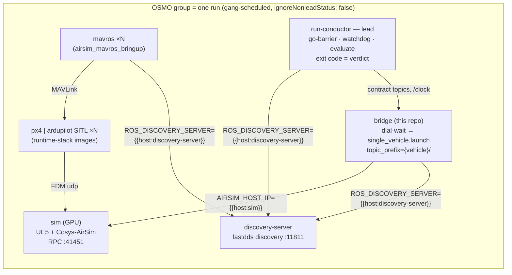

<!-- copied from TEVV-Airsim-ROS2-Bridge@2007b6c (docs/OSMO.md); edit there, not here -->
# Running the bridge under NVIDIA OSMO (TEVV platform run plane)

How this repo fits the Autonomy TEVV platform's orchestration layer, what the
bridge image now provides for it, and the constraints that are **decisions for
the platform owner**, not bugs in the bridge.

Context: the platform architecture lives in a separate repo
(`autonomy-tevv-architecture`, specs dated 2026-07-10 / 07-13 / 08-18). The
2026-07-13 variant makes [NVIDIA OSMO](https://github.com/NVIDIA/OSMO) the
orchestrator: **one gang-scheduled OSMO group = one TEVV run**, the
`run-conductor` is the group's `lead` task and its exit code is the verdict.
This repo is *one task* in that group — the ROS 2 face of the
`sim: cosys-airsim-ue5` profile. It is not the platform, the harness, or the
conductor.

- Submittable example: [`osmo/bridge-certify.workflow.yaml`](../osmo/bridge-certify.workflow.yaml)
- Component contract the compiler reads: [`tevv.yaml`](../tevv.yaml)
- Authoritative topic list: [`src/airsim_ros2_bridge/config/topic_contract.yaml`](../src/airsim_ros2_bridge/config/topic_contract.yaml)

---

## 1. OSMO in five facts (verified against the user guide, 2026-09-21)

| OSMO concept | What it means for a run |
|---|---|
| **`groups[].tasks[]`, exactly one `lead: true`** | All tasks of a run are gang-scheduled; the lead's exit code decides the group. Bridge is a non-lead task. |
| **`barrier: true` (default)** | No task starts until every image is pulled and every container is ready. Necessary, not sufficient: *container running ≠ sim answering RPC*. The bridge adds its own dial-wait (§3). |
| **`ignoreNonleadStatus: false`** | Default is `true`, which restarts a dead non-lead task *alone* while the group keeps running. A fresh bridge rejoining a mid-mission graph corrupts it silently; the compiler must emit `false` so any death fails the gang for a clean reschedule. |
| **`{{host:<task>}}`** | Live DNS name of another task in the group. Replaces the per-run ClusterIP Service: `AIRSIM_HOST_IP={{host:sim}}`, `ROS_DISCOVERY_SERVER={{host:discovery-server}}:11811`. |
| **`exitActions: {COMPLETE, FAIL, RESCHEDULE}` keyed by exit-code ranges** | Default: 0 → COMPLETE, preempted → RESCHEDULE, else FAIL. User codes must be ≤ 255. Service codes: `3006` preempted, `3004` evicted, `3005` start timeout, `137` OOM. |

Other facts that matter here: `workflow.labels` (max 16, immutable) **do exist**
in the current spec and are settable with `osmo workflow submit --label k=v` —
the 2026-07-13 spec's review recorded "workflows carry no labels"; that is
stale and the registry-only lookup for auto-cancel can be relaxed. Timeouts are
per group, wall-clock, single unit (`30m`, not `1h30m`). `volumeMounts:` host
mounts exist (`/dev/shm` is the documented example); `hostNetwork` and
`privileged` are task booleans. Local dev deployment is `kind` + KAI scheduler
+ CloudNativePG + the OSMO Helm chart, ~20 min.

## 2. The bridge's exit-code contract

Rendered into every workflow by the platform compiler; hand-written in the
example. The bridge itself only ever produces `0`, `1` and `42`.

| Exit | Meaning | OSMO action | Registry |
|---|---|---|---|
| `0` | task finished normally | COMPLETE | — |
| `1` | contract / validation violation (certify lead only) | FAIL, **never retried** | FAILED |
| `42` | readiness timeout — sim RPC never answered within `AIRSIM_DIAL_WAIT_SEC`, or contract topics never appeared | RESCHEDULE (cap enforced by conductor/registry) | INFRA_FAILED |
| `137` | OOM / SIGKILL | RESCHEDULE (OSMO default) | INFRA_FAILED |
| `3006` | preempted by KAI for a higher-priority group | RESCHEDULE (OSMO default) | new attempt |

`42` is the platform's "platform fault detected by conductor" code. Using it
from the bridge entrypoint means a slow UE5 boot is classified as INFRA, never
as a stack failure — the FAILED vs INFRA_FAILED invariant developers rely on.

## 3. What the image provides for an orchestrated run

| Need | Provided by | Notes |
|---|---|---|
| Wait for the sim before launching | `docker/entrypoint.sh`: `AIRSIM_DIAL_WAIT_SEC`, `AIRSIM_HOST_IP`, `AIRSIM_HOST_PORT` | TCP dial on the RPC port; exit 42 on expiry. Also injects `host_ip:=`/`host_port:=` into a `ros2 launch` CMD. |
| Reconnect if the sim restarts mid-run | launch `respawn=True, respawn_delay=5.0` on the vehicle node | Under `ignoreNonleadStatus: false` the gang fails first, so in-run reconnect is a dev convenience, not a platform mechanism. |
| Contract topics `/clock`, `/tf`, `/<v>/ground_truth/odom`, `/<v>/collision` | bridge nodes | `topic_prefix:={vehicle}/` **must** be passed — the image default is bare topics (§5). |
| Sim time authoritative | `/clock` from the AirSim clock; `use_sim_time:=true`; `stamp_odom_with_sim_time` (default) | Settings variants ship `LockStep: true` for px4/ardupilot. |
| Unicast DDS discovery (no multicast in pod networking) | `ROS_DISCOVERY_SERVER=<host>:11811` on every node; `config/fastdds-discovery-superclient.xml` for tooling | Bridge nodes need only the env var. `ros2 topic list` and the certification scripts need SUPER_CLIENT or they see an empty graph. |
| stdout-only logs | `RCUTILS_LOGGING_USE_STDOUT=1`, `RCUTILS_COLORIZED_OUTPUT=0` in task env | No log files in the container. |
| A verdict-producing task | `certify` in the example: `test_topic_contract.py --check-stamps`, `test_tf_tree.py`, `test_sensor_fidelity.py`, merged into one `mns.bridge.validation.v1` report under `{{output}}` | This is the sim profile's **certification suite** (spec §5.4). |
| MCAP bags, split by size | `make bag` (`BAG_STORAGE=mcap`, `BAG_MAX_SIZE`) | The rolling uploader is a harness task, not the bridge's. |

## 4. Group topology for the sim profile



In `osmo/bridge-certify.workflow.yaml` the `certify` task stands in for the
conductor so the file is submittable without the platform. In a real suite the
conductor is the lead and `certify`'s checks become its go-barrier.

## 5. Constraints for the platform owner

These are decisions the bridge cannot make alone. Each is recorded with the
default this repo assumes.

1. **SHM transport needs sim + bridge in ONE task.** iceoryx2 zero-copy
   (`TRANSPORT=shm`) requires a shared `/dev/shm` *and* `/tmp/iceoryx2` and the
   same IPC namespace. OSMO `volumeMounts: [/dev/shm, /tmp/iceoryx2]` gives a
   shared host segment but does **not** guarantee both tasks land on the same
   node, and does not share the IPC namespace. Options: (a) RPC transport on
   the cluster — what the example does; costs lidar/camera bandwidth over the
   RPC path; (b) one task whose image runs UE5 and the bridge under a
   supervisor — then the bridge is a *sidecar process* of the sim task, not a
   task. The spec's run-plane diagram draws them as separate pods; (b) changes
   the `cosys-airsim-ue5` profile definition. **Default assumed: (a).**
2. **`comms: zenoh` semantics differ.** The spec's zenoh profile is
   `rmw_zenoh_cpp` + `rmw_zenohd`. This repo's working cross-host path is a
   `zenoh-bridge-ros2dds` gateway over a **CycloneDDS** graph
   (`docker/compose/zenoh.yml`). Spec §16 already defers `rmw_zenoh` to
   component owners. Proposal: accept `zenoh-bridge` as the pilot zenoh profile
   (declared in `tevv.yaml`), evaluate `rmw_zenoh` when Humble packages are
   pinned. Note FastDDS↔Cyclone data never crosses — one RMW per group.
3. **Bare topics vs `/<vehicle>/`.** Image default is bare (`/ground_truth/odom`).
   The contract surface is `/<vehicle>/…`. Orchestrated runs pass
   `topic_prefix:={vehicle}/` (done in the example and `tevv.yaml`). Either the
   compiler always passes it, or the spec relaxes to bare for `drones: 1`.
4. **FastDDS Discovery Server vs SHM.** FastDDS SHM transport is broken under
   a shared IPC namespace (`config/fastdds-udp-only.xml` exists for that). With
   separate tasks there is no shared IPC, so the DS profile works with builtin
   transports; if (1b) is ever chosen, pair it with the UDP-only profile.
5. **Auto-cancel can use OSMO labels.** `workflow.labels` exist now; the
   registry-only lookup in the 2026-07-13 spec was written against an older
   OSMO. Cancellation is still by exact workflow id.

## 6. Setting up and testing, in stages

Each stage proves one thing and is the prerequisite of the next. Workstation
facts these were written against (2026-09-21): Docker 29.5, NVIDIA runtime +
CDI present, RTX 5080 16 GB, 24 cores / 62 GB RAM, **root disk 99 % full
(31 GB free)** — kind nodes keep their own image store, so the bridge image
(3.7 GB) is loaded twice and a UE5 sim image (tens of GB) does not fit until
disk is reclaimed. `docker images | grep airsim-ros2-bridge` shows ~10 near-
identical bridge tags; pruning them is the cheapest 30 GB.

### Stage 0 — prerequisites (host)

```bash
# tools the OSMO local guide expects: Docker >= 28.3, kind >= 0.29, kubectl >= 1.32, helm >= 3.16
curl -Lo /usr/local/bin/kind https://kind.sigs.k8s.io/dl/latest/kind-linux-amd64 && chmod +x /usr/local/bin/kind
curl -LO "https://dl.k8s.io/release/$(curl -Ls https://dl.k8s.io/release/stable.txt)/bin/linux/amd64/kubectl" && sudo install kubectl /usr/local/bin/
curl -fsSL https://raw.githubusercontent.com/helm/helm/main/scripts/get-helm-3 | bash
curl -fsSL https://raw.githubusercontent.com/NVIDIA/OSMO/refs/heads/main/install.sh | bash   # osmo CLI -> /usr/local/osmo
git clone https://github.com/NVIDIA/OSMO.git ~/OSMO
```

Reclaim disk to >= 60 GB free before Stage 1.

### Stage 1 — CPU kind cluster + OSMO control plane (~20 min)

```bash
cd ~/OSMO
kind create cluster --config kind-osmo-cluster-config.yaml && kubectl config use-context kind-osmo
helm upgrade --install kai-scheduler oci://ghcr.io/nvidia/kai-scheduler/kai-scheduler --version v0.12.10 \
  --create-namespace -n kai-scheduler \
  --set-string 'global.nodeSelector.osmo\.nvidia\.com/node-pool=control-plane' \
  --set "scheduler.additionalArgs[0]=--default-staleness-grace-period=-1s"
helm repo add cnpg https://cloudnative-pg.github.io/charts
helm upgrade --install cnpg cnpg/cloudnative-pg --version 0.29.0 -n cnpg-system --create-namespace
helm dependency build deployments/charts/osmo
helm upgrade --install osmo deployments/charts/osmo -n osmo --create-namespace --wait --timeout 20m
kubectl -n osmo get secret osmo-embedded-dex-admin -o jsonpath='{.data.password}' | base64 -d; echo   # admin@osmo.local
osmo login http://127.0.0.1 && osmo profile set pool default
osmo workflow submit deployments/workflows/verify-hello.yaml && osmo workflow query <id>
```

**Proves:** control plane, KAI, backend agent, `osmo` CLI. The chart provisions
`cpu` and `gpu` platforms in pool `default`; `osmo resource list` shows the
platform names to put in the workflow's `platform:` fields.

### Stage 2 — bridge + certify in the cluster, sim on the host

The sim keeps running where it runs today (`make dev`, runtime-stack compose,
or the UE editor). Only the bridge image goes into the cluster.

```bash
ss -ltnp | grep 41451                                     # AirSim RPC must be on 0.0.0.0
kind load docker-image tevv-airsim-ros2-bridge:humble --name osmo
osmo workflow submit osmo/bridge-certify-hostsim.workflow.yaml --dry-run          # schema only
osmo workflow submit osmo/bridge-certify-hostsim.workflow.yaml \
  --set sim_host=<host LAN IP, e.g. 10.130.3.180> --set bridge_image=tevv-airsim-ros2-bridge:humble \
  --set cpu_platform=<name from osmo resource list> --label suite=bridge-certify --label stage=hostsim
osmo workflow query <id>; osmo workflow logs <id> certify
```

Pods reach the host by its LAN IP, never `127.0.0.1`. If the dial-wait times
out, check the host firewall for the kind bridge network on TCP 41451.

**Assert, in this order:**

| Check | How | Expected |
|---|---|---|
| Gang barrier + `{{host:}}` DNS | `osmo workflow logs <id> bridge` | `entrypoint: AirSim RPC <ip>:41451 reachable`, then launch output |
| Discovery server works | `osmo workflow logs <id> certify` | `contract topics present; running suites` |
| PASSED path | certify exit 0 | workflow `COMPLETED`; `validation.json` in the task output |
| FAILED path (verdict, no retry) | `--set` a bad expectation, e.g. `STAMP_WINDOW=0.0001` via a copy of the file | certify exit 1 → group `FAILED`, **no** reschedule |
| INFRA path (exit 42) | `--set sim_host=10.255.255.1` and `AIRSIM_DIAL_WAIT_SEC` low | bridge exit 42 → RESCHEDULE per `exitActions`; check the retry ID increments |
| Gang integrity | `kubectl -n <osmo workflow ns> delete pod <bridge pod>` mid-run | whole group fails and reschedules (`ignoreNonleadStatus: false`), not a solo bridge restart |
| Collision topic present | in the certify log, `test_topic_contract.py` lists `/<vehicle>/collision` as matched | no `MISSING vehicle topic collision` |
| Collision topic live | `make test-collision` on a workstation (SimpleFlight or SITL attached): `test/test_collision_topic.py --expect-increment 1` in the container while `scripts/trigger_collision.py` flies the drone into the ground | latched sample `count=0` on join, then `count>=1`, `has_collided=True`, `object_name` set, stamp in the `/clock` domain |

### Stage 3 — sim inside the cluster (GPU)

Needs: disk for the UE5 image inside the kind node, `nvkind` instead of
`kind`, and the GPU operator. Headless rendering already exists in the
runtime stack: `AIRSIM_HEADLESS=true` maps to
`-RenderOffScreen -NoSound -Unattended -NoSplash` in its compose commands and
`launch.sh` (never `-NullRHI`, which breaks AirSim cameras). The `sim` task in
`bridge-certify.workflow.yaml` mirrors that command with `sim_binary` as a
Jinja variable (default the Condo build's `/app/Condo/Condo.sh`); what is
still runtime-stack work is a headless *profile* that drops the X11 mounts
rather than only adding the flag (their `docs/osmo-mapping.md` §3.2).

```bash
# from the OSMO repo, after installing nvkind (https://github.com/NVIDIA/nvkind)
nvkind cluster create --config-template=kind-osmo-cluster-config.yaml && nvkind cluster print-gpus
helm upgrade --install gpu-operator nvidia/gpu-operator --version v25.10.1 -n gpu-operator --create-namespace \
  --set driver.enabled=false --set toolkit.enabled=false
# ... Stage 1 helm steps, then:
kind load docker-image <sim image> --name osmo
osmo workflow submit osmo/bridge-certify.workflow.yaml --set sim_image=<sim image> \
  --set gpu_platform=<gpu platform name> --set cpu_platform=<cpu platform name> --priority HIGH
```

**Proves:** the full group topology, GPU scheduling, cold-start budget
(`AIRSIM_DIAL_WAIT_SEC=600`), and whether RPC-only transport is acceptable for
the profile (§5 item 1).

### Stage 4 — the real cluster

Same YAML. Differences are all platform-side: `--pool`, KAI queue and
priorities per tier, Harbor digests in `--set *_image`, the run-conductor as
lead instead of `certify`, registry writes. Nothing in this repo changes.

### Teardown

```bash
helm uninstall osmo -n osmo --wait
kind delete cluster --name osmo        # or: nvkind cluster delete --name osmo
```

## 7. Not done here

- PX4/ArduPilot SITL and MAVROS tasks in the example group (images live in
  `M-S-Simulation-Runtime-Stack`; add them as tasks addressing `{{host:sim}}`).
- Registry writes, PR feedback, attempt numbering, MCAP rolling upload — all
  conductor/harness responsibilities per the spec.
- `l0_tests` replay datasets for the bridge (candidates: bag-replay TF and
  contract checks).
