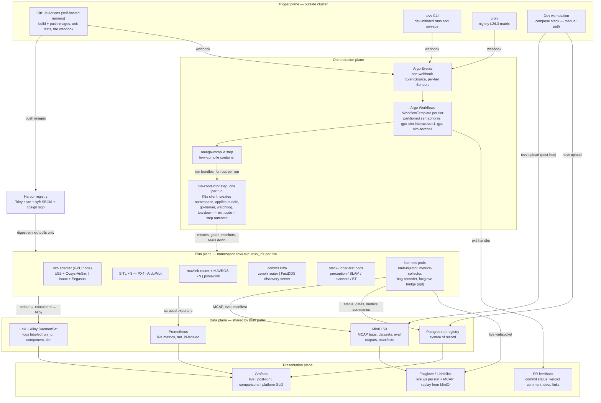
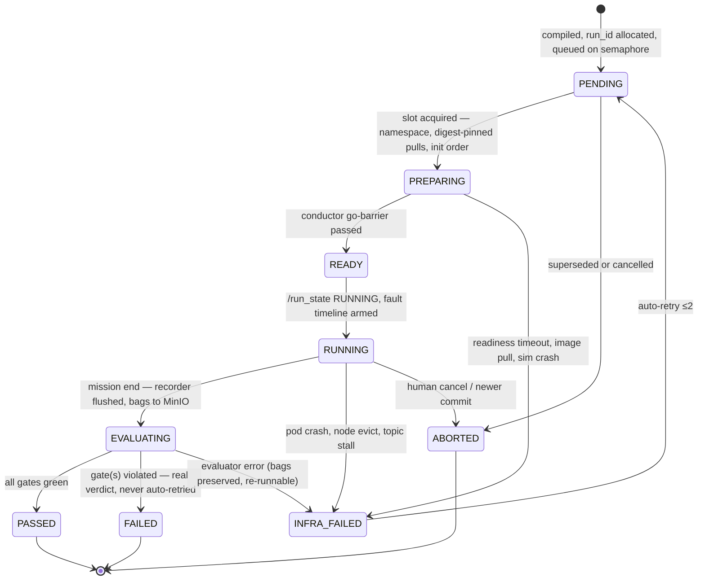

# Autonomy TEVV Platform — System Architecture Design

- **Date:** 2026-07-10
- **Status:** Draft for review
- **Approach:** A — Pipeline-first (Argo-native, thin platform) — selected over B (control-plane service) and C (federated GitOps)
- **Deliverable:** this spec seeds the `architecture/` doc set, `schemas/`, `diagrams/`, and phased `tasks/` handoffs of this repo
- **Variant:** [2026-07-13 OSMO orchestration variant](2026-07-13-autonomy-tevv-osmo-orchestration-design.md) proposes NVIDIA OSMO as the orchestration layer, superseding §7 and parts of §8/§11/§13 if adopted; this document remains the Argo-native baseline and rationale record

## 1. Purpose and scope

A Test, Evaluation, Verification & Validation (TEVV) platform for a multi-drone autonomy stack. It lets developers test bottom-up — individual components (Perception, SLAM, Global Planner, Local Planner, Behavior Trees) → sub-stack integrations → full stack → mission autonomy — in simulation, either manually (quick algo iteration) or automated (CI-triggered regression, parameter tuning, algo comparison under identical conditions).

In scope: test taxonomy, declarative test contract (omega YAML), scenario compiler, orchestration on Kubernetes, run data plane (logs/metrics/rosbags/registry), observability, interchangeability of sim engine / autopilot / middleware / comms, fault injection, DevSecOps & MLSecOps integration surfaces, platform self-testing, phasing.

Out of scope: the autonomy algorithms themselves; hardware-in-the-loop and field testing (the taxonomy leaves room above L3); building a model registry (we integrate with one).

## 2. Context and constraints

### 2.1 Existing assets (reused, not rebuilt)

`M-S-Simulation-Runtime-Stack` (docker-compose, single host) provides:

- Jinja-generated scenarios (`tools/generate_scenario.py`, `.env` as source of truth): PX4/ArduPilot SITL × UE5 5.5.4 + Cosys-AirSim scenes (condo/xfs/safticity), 1–16 drones, mavlink-router hub, MAVROS sidecars, per-drone ROS 2 bridges, Zenoh bridge for `/shared/*` mesh.
- TEVV building blocks: metrics-collector (`run_id`/`scenario_id`, `/run_state` lifecycle RUNNING/COMPLETED/ABORTED), `evaluate.py` pass/fail gates (`evaluation.yaml`), mission-supervisor live topics, Prometheus exporters (ros2/airsim/px4/node/dcgm/cadvisor), Grafana TEVV dashboard, Loki+Alloy logs overlay, Foxglove-bridge/Lichtblick.
- Known defects to design around: AirSim ROS 2 bridge connects once with no auto-reconnect; PixelStreaming requires a UE build cooked with the plugin (condo build lacks it); Elasticsearch disk-watermark incidents silently dropped run results.

### 2.2 Decisions fixed during brainstorming

| # | Question | Decision |
|---|----------|----------|
| 1 | Infra substrate | On-prem, self-hosted Kubernetes; S3 = MinIO |
| 2 | Scale | Pilot: 1–2 concurrent GPU sim runs, ~5–15 devs, tens of runs/day — schemas and interfaces must scale without redesign |
| 3 | Test modality | Tier-dependent: replay/mocks at component tier, live sim from sub-stack up |
| 4 | Trigger policy | Tiered by event: commit → CPU-only tests; PR → sub-stack sim smoke; merge → full-stack; nightly/on-demand → mission tier and sweeps |
| 5 | Network posture | Connected now, air-gap-clean artifact flow (everything through internal registry) so air-gapping later is policy, not redesign |
| 6 | Architecture shape | Approach A: Argo-native pipeline, one scenario compiler for both runtimes, thin run-registry as the only new persistent component |
| 7 | Log/search stack | No ELK. Postgres registry + Loki logs + Grafana. Optional Alloy tee to a corporate SIEM if mandated |

### 2.3 Workspace conventions honored

- Requirements traceability is first-class: every suite declares the requirement IDs it verifies; the verification matrix is generated by query, never hand-maintained.
- Explicit pass/fail criteria everywhere, including for the platform itself (INFRA_FAILED rate SLO).
- Architecture-as-Code: Markdown + Mermaid, ADRs for contested decisions.

## 3. System overview

Five planes. The automated and manual paths converge on one data plane, so a quick workstation run and a nightly sweep are the same kind of record.



Standalone sources: `diagrams/system-architecture.mermaid` (this structure), `diagrams/system-data-flow.mermaid` (end-to-end run flow).

### 3.1 Manual path

Unchanged developer experience: the compose stack launches as today, from the same compiled bundles (`--target compose`). A run only becomes a record if the developer runs `tevv upload` (registers run, pushes bags/metrics/log archive). Quick-and-dirty runs record nothing, by design. The local monitoring/logs overlays (`docker-compose-monitoring.yml`, `docker-compose-logs.yml`) remain the live view for manual runs.

## 4. Test taxonomy

| Tier | Scope | Modality | Default trigger | Compute |
|------|-------|----------|-----------------|---------|
| **L0 Component** | Perception, SLAM, planner, BT in isolation | Open-loop rosbag/dataset replay; BTs vs mocked services; planners vs recorded costmaps | Every commit (through Argo so results land in the registry) | CPU pods; `gpu-inference` for perception models |
| **L1 Sub-stack** | Integrated pairs (e.g. global+local planner, perception+SLAM) | Live sim, small scene, 1 drone, short mission | PR open/update (smoke) | 1 `gpu-sim` slot, minutes |
| **L2 Full stack** | Entire autonomy stack closed-loop | Live sim, standard scenario set | Merge to main; nightly regression | 1 `gpu-sim` slot |
| **L3 Mission** | Multi-drone mission autonomy, BT-driven; param sweeps, algo A/B | Live sim, large scenes, long duration, N drones | Nightly; on-demand via tevv CLI | 1–2 slots, long-running |

CI runners execute only image build + pure unit tests. Everything that produces a test verdict goes through Argo, so all results land in one registry with full traceability.

## 5. Omega contract and scenario compiler

### 5.1 Config model — three layers, merged in order

1. **`omega.yaml`** (integration repo, one per suite): tier, requirement IDs verified, scenario (world, drones, origin preset), stack composition (component refs), platform axes, mission, fault timeline, evaluation gates, record allowlist, matrix.
2. **`tevv.yaml`** (one per component repo): component id and type, image/launch entrypoint, config schema and defaults, **provides/requires interfaces (topics, services, types, QoS)**, L0 replay test definitions and datasets, resource profile.
3. **Trigger params** (CI/CLI/cron): SHA/image overrides, tier, matrix subset, priority, run reason.

The `origin` preset resolves the sim `OriginGeopoint` and the autopilot home coordinates from one source, eliminating the known EKF-origin drift footgun.

### 5.2 tevv-compile

Evolution of `tools/generate_scenario.py`, shipped as a versioned container. Pipeline:

1. Schema validation (JSON Schema; fails fast in CI).
2. Component resolution — every image pinned to a Harbor **digest**.
3. Interface check — provides/requires wiring **including QoS compatibility**; a mismatch is a compile error, not a silently dead sim run.
4. Fault capability check — requested faults validated against the platform profile's declared `fault_capabilities`.
5. Matrix expansion — sweep axes (params and fault params) → run list; run_ids allocated.
6. Emit one **run bundle** per run.

Run bundle: K8s manifests/Argo DAG params (`--target k8s`) or compose files (`--target compose`; today's four scenarios become presets), sim config (AirSim `settings.json` via existing Jinja partials; Isaac/Pegasus config), autopilot params, mavlink-router/MAVROS/pymavlink config, comms config (zenoh router config or FastDDS profiles XML + discovery server address), `evaluation.yaml` + bag topic allowlist, and `manifest.json` — full provenance (every input digest, compiler version, resolved params) making any run reproducible.

### 5.3 Example omega.yaml

```yaml
suite: l1-planner-substack-smoke
tier: L1
verifies: [REQ-NAV-012, REQ-NAV-031, REQ-FLT-004]

scenario:
  world: xfs
  drones: 1
  origin: preset:xfs          # geopoint + autopilot homes, single source

platform:                     # the 4 interchangeability axes
  sim: cosys-airsim-ue5       # | isaac-pegasus | <custom>
  autopilot: ardupilot        # | px4
  middleware: ros2-mavros     # | direct-mavlink
  comms: zenoh                # | fastdds-ds

stack:
  - component: global-planner
    ref: ${TRIGGER_SHA}
  - component: local-planner
    ref: pinned@sha256:ab12…
    params: { max_vel: 4.0 }

mission:
  type: waypoints             # | goal | exploration | bt-mission
  file: missions/xfs_loop.json
  timeout_sec: 600.0

faults:                       # timeline, sim-time or event anchored
  - at: t+120s
    inject: gps_denial        # sim backend
    scope: drone:1
    duration: 60s
  - at: waypoint:3
    inject: wind_gust         # sim backend
    params: { vector_ms: [8, 0, 0], gust_sd: 2.0 }
  - at: t+200s
    inject: link_degrade      # link backend
    params: { drop_pct: 30, latency_ms: 250 }

evaluation:
  gates:                      # explicit pass/fail
    collisions: { max: 0 }
    goal_reached: true
    travel_time_sec: { max: 300 }
    position_error_m: { max: 5.0, during: gps_denial }
    recovery_time_s: { max: 10, after: link_degrade }

record:
  topics: [ "/+/ground_truth/odom", "/+/goal", "/tf", "/fault_state" ]

matrix:
  local-planner.params.max_vel: [2.0, 4.0, 6.0]
  faults[2].params.drop_pct: [0, 30, 60]
```

### 5.4 Interchangeability — platform axes and contract

Four axes resolved as profiles at compile time:

| Axis | Initial profiles | Profile expands to |
|------|------------------|--------------------|
| `sim` | `cosys-airsim-ue5`, `isaac-pegasus`, custom | Sim pod(s) + bridges producing the contract topics; config renderer; GPU node class; `fault_capabilities` |
| `autopilot` | `px4`, `ardupilot` | SITL image + params + mavlink-router endpoints (exists today) |
| `middleware` | `ros2-mavros`, `direct-mavlink` | MAVROS sidecars per drone, or raw MAVLink endpoint for pymavlink stacks |
| `comms` | `zenoh`, `fastdds-ds` | Zenoh router pod + bridge/rmw config, or FastDDS discovery-server pod behind a per-run ClusterIP Service (stable DNS/IP known at render time) + injected profiles XML; participant pods dial-wait the service in an init container. DDS multicast discovery does not survive K8s pod networking, so both profiles are unicast-rooted |

**Contract topic/service surface** every combination must present: `/clock` (sim time), `/run_state`, `/<vehicle>/ground_truth/odom`, `/<vehicle>/collision`, sensor topics per interface spec, and the command surface (ROS setpoints/services or MAVLink endpoint per middleware profile).

**Time base (contract requirement):** sim time is authoritative — the autopilot must be lockstep-coupled to the sim (PX4 lockstep; ArduPilot blocks on its FDM loop), `/clock` drives the fault timeline and all sim-time gates, and wall-clock is used only for phase budgets. The conductor monitors the real-time factor; RTF collapse below a floor is INFRA_FAILED, so sim stutter can never masquerade as a stack failure.

**Platform certification suite**: a small TEVV-owned conformance test that any new profile combination must pass before omega files may reference it. It doubles as the platform's own integration test (canary, §9).

## 6. Fault injection

Timeline-driven, anchored to sim time (`t+120s`) or mission events (`waypoint:3`); executed by the **fault-injector** harness pod against `/clock`; every injection publishes `/fault_state` and is recorded to the registry (`fault_events`) for Grafana annotations and fault-scoped gates (`during:` / `after:`). Fault params can be matrix axes.

| Backend | Fault classes | Mechanism |
|---------|---------------|-----------|
| sim | GPS denial, sensor blackout/noise, wind/gusts, lighting | Sim adapter API (AirSim RPC; Isaac equivalents) |
| autopilot | Motor/ESC failure, battery sag, EKF glitch | PX4 failure injection (`SYS_FAILURE_EN`); ArduPilot `SIM_*` params |
| link | MAVLink drop/latency/jitter, partition | TEVV mavlink-proxy in the router path (userspace — no elevated capabilities). `tc netem` deferred: needs NET_ADMIN, which conflicts with the default-deny posture (§16) |
| ros | Topic drop/delay/corrupt between components | Degrader nodes spliced in by the compiler |

Profiles declare `fault_capabilities`; unsupported faults are compile-time errors, never silent no-ops.

## 7. Orchestration and run plane

- **Inbound**: one webhook endpoint (Argo Events EventSource) with documented payload `{repo, sha, tier, suite, matrix, priority, reason}` — CI-vendor-agnostic (GitLab later = swap caller). Per-tier Sensors trigger WorkflowTemplates.
- **Workflow shape**: step 1 `omega-compile`; step 2 fan-out (`withParam`) over run bundles. Each run executes as a single **run-conductor step** — a container holding a K8s client that creates the namespace, applies the bundle, runs the go-barrier and watchdog, tears down on completion, and exits 0/1 as the step outcome. Argo sequences steps and holds semaphores; it never micro-manages the multi-pod run topology (Argo `resource` templates cannot sequence or supervise a long-running 10-pod stack). An exit handler backstops recording/teardown if the conductor itself dies.
- **Concurrency**: partitioned Argo semaphores (ConfigMap) — `gpu-sim-interactive: 1` (PR smoke, merge) and `gpu-sim-batch: 1` (nightly, sweeps, manual cluster runs). Argo priority orders queues but never preempts a running workflow, so without the partition a multi-hour L3 sweep would starve PR feedback. Hardware growth = edit two numbers; fair-share (Kueue) only if slot count grows past hand-tuning. **Auto-cancel**: newer commit on same PR+suite supersedes queued and running runs (→ ABORTED) — implemented as a pre-submit step that stops workflows matching the `{pr, suite}` labels via the Argo API (not natively declarative).
- **Isolation**: namespace per run (`tevv-run-<run_id>`) for teardown, NetworkPolicy scoping, and DDS containment. Node classes: `gpu-sim` (UE5/Isaac), `gpu-inference` (perception), `cpu` (everything else).
- **Run pods** (full-stack example): sim adapter, SITL ×N, mavlink-router, middleware (MAVROS ×N | pymavlink), ros2 bridges, comms infra (zenoh router | FastDDS discovery server), stack-under-test pods (digest-pinned), harness (fault-injector, metrics-collector + mission-supervisor, bag-recorder, optional foxglove-bridge, optional pixel-streaming for UE builds with the plugin). All run pods carry explicit ephemeral-storage requests/limits so disk pressure can never evict the sim.

## 8. Run lifecycle and failure handling

**Invariant: FAILED means the stack-under-test misbehaved; INFRA_FAILED means the platform did.** Only INFRA_FAILED auto-retries (≤2, backoff). Developers must never chase platform flakiness as their bug.



- **run-conductor** (the per-run Argo step, §7): readiness barrier (sim RPC answers, SITL heartbeats, MAVROS `/state.connected`, contract topics at expected rates, `/clock` ticking, TF sane) → only then mission start. Watchdog during RUNNING: topic-liveness measured against sim time (odom stall = hung), RTF floor, pod-crash policy (abort unless component marked `optional`), phase budgets in wall-clock (prepare/mission/evaluate timeouts). This kills the startup-race class of flaky sim CI and absorbs the bridge-no-reconnect defect: ordering via init containers and readiness gates; mid-run sim death = INFRA_FAILED + retry, no in-run reconnect logic at pilot scale.
- **Probe rule**: readiness probes are for startup ordering only; **no K8s liveness probes on sim-time-dependent pods** — kubelet probes run on wall-clock and would kill healthy stacks whenever RTF drops. The conductor, which understands sim time, is the sole liveness authority for the run.
- **Attempts**: an INFRA_FAILED auto-retry re-executes the same logical run as `attempt+1` — same `run_id`, new attempt row. The platform SLO counts attempts; verdicts and gate results attach to the final attempt; dashboards never double-count a retried run.
- **mission_timeout is a FAILED verdict** (performance judgment), not infra.
- **Cleanup guarantees**: exit handler always collects diagnostics (pod states, events, last logs, dcgm snapshot), uploads, writes terminal status + `failure_reason`, deletes the namespace, releases the semaphore. A janitor CronWorkflow sweeps orphaned `tevv-run-*` namespaces past TTL and reconciles registry rows stuck non-terminal.
- **Failure taxonomy** (`failure_reason`): `readiness_timeout`, `sim_crash`, `pod_crash`, `infra` (pull/evict/PVC), `mission_timeout` (→ FAILED), `evaluator_error`, plus derived `flaky_suspect` (same SHA+suite alternating verdicts → suite quarantined from merge-blocking until triaged). Grafana trends INFRA_FAILED rate as the **platform SLO** (target <5% of runs).
- **PR feedback**: commit status per suite; comment with verdict, gate table, deep links (Grafana run dashboard, Foxglove live/replay, Loki query).

## 9. Data plane

### 9.1 Run registry (Postgres, CloudNativePG; single instance at pilot, WAL-archived to MinIO)

Core table `runs`:

| Column | Type | Nullable | Indexing | Scale / retention |
|--------|------|----------|----------|-------------------|
| run_id | ULID | no | pk (run_id, attempt) | tens/day; rows kept indefinitely |
| attempt | smallint, default 1 | no | pk (run_id, attempt) | increments on INFRA_FAILED auto-retry; child tables key on (run_id, attempt) |
| suite_id | text fk | no | btree (suite_id, started_at) | — |
| tier | enum L0–L3 | no | — | — |
| trigger / trigger_ref | enum + text (PR#, SHA) | no | btree trigger_ref | — |
| platform | jsonb (4 axes) | no | GIN | sweep/compare queries |
| matrix_point | jsonb | yes | GIN | — |
| status / verdict | enums | no | btree verdict | — |
| failure_reason | enum | yes | btree | platform SLO queries |
| started_at / ended_at | timestamptz | yes | btree | — |
| argo_workflow_id | text | yes | — | — |
| manifest_uri | text (S3) | no | — | provenance |

Supporting tables: `suites` (omega ref+digest, requirement_ids[]), `requirements` (synced by import job — **the verification matrix becomes a SQL view**, `v_verification_matrix`), `gate_results` (run × gate: expected/actual/passed/fault scope/req ids), `metrics_summary` (run × metric: value, unit), `components` (run × component: repo, SHA, image digest, params — powers algo A/B queries), `fault_events`, `artifacts` (kind, s3_uri, checksum, retention class), `datasets` (immutable L0 replay inputs with provenance).

Growth path: writes go through a small **telemetry-writer interface**; today summaries → Postgres; later bag-extracted timeseries → ClickHouse for cross-run analytics, with no schema break. Adoption trigger: cross-run analytic queries exceed ~5 s or telemetry rows exceed ~10⁷/day.

### 9.2 Object store (MinIO)

```text
tevv-runs/<yyyy>/<mm>/<run_id>/
  bags/*.mcap          # rosbag2 MCAP storage plugin
  eval/{metrics,evaluated}.json
  video/*.mp4          # optional sim capture
  logs/…               # failure exports, PX4 ulog / ArduPilot BIN+tlog
  manifest.json        # provenance
tevv-datasets/<dataset_id>/…   # immutable, versioned
```

**MCAP** because Foxglove streams it straight from S3 (no download-then-open) and it is self-describing. **Recorder storage**: the bag-recorder writes to a dedicated volume (storage-class PVC, or node-local SSD on the sim node), records with rosbag2 split-by-size, and a companion uploader ships each closed segment to MinIO and deletes it locally — disk usage stays bounded regardless of run length, and partial data survives a mid-run crash (an upload-at-exit design would lose everything with the node). Retention by lifecycle policy: PR smoke 14 d; merge/nightly 90 d; release-tagged kept. Registry rows outlive artifacts (`artifacts.status = expired`).

### 9.3 Logging topology (multi-pod answer)

1. Every process logs to stdout/stderr only (ROS 2: `RCUTILS_LOGGING_USE_STDOUT=1`). No log files in pods.
2. containerd writes `/var/log/containers` on each node; **Grafana Alloy DaemonSet** scrapes and relabels from pod labels (`tevv.io/run-id`, `tevv.io/component`, `tevv.io/tier`). Static index labels: `{component, tier}`; `run_id` and namespace ride as **Loki structured metadata** (Loki ≥3) — per-entry, queryable, but never index cardinality.
3. One Loki query (`{component=~".+"} | run_id="…"` — packaged as a Grafana variable) returns the interleaved logs of every pod in a run. Retention 30 d default (config knob; raising it is storage, not architecture).
4. No separate `/rosout` aggregator — redundant with per-pod stdout.
5. Autopilot logs (ulog/BIN/tlog) uploaded as artifacts by the recorder sidecar.
6. On failure, the exit handler exports the run's full Loki stream to S3 — forensics survive log retention.
7. Manual path: local Loki via existing `docker-compose-logs.yml`; `tevv upload` ships a log archive.

### 9.4 Metrics — live and post-process

- **Live**: existing exporters (ros2/airsim/px4) as per-run sidecars; PodMonitor created first thing in PREPARING so Prometheus discovery latency (~15–30 s) overlaps sim boot; `run_id` label **only on run-scoped exporter series** — bounded by run count (tens/day ⇒ trivial churn for Prometheus), while node/dcgm/cadvisor stay cluster-scoped with no per-run labels. Live metrics are best-effort for short runs; **gates always come from MCAP post-processing**, so a missed scrape can never change a verdict. Pushgateway only for batch-step final states (it is not a live-streaming path).
- **Post-process**: evaluation step after the sim step runs **pluggable evaluator containers** (declared per suite / per repo tevv.yaml) that read the fresh MCAP from MinIO and write gate results + metric summaries to the registry. Devs add custom metrics by shipping an evaluator image, not by patching the platform.

## 10. Observability and presentation

- **Grafana** (sole dashboard system): datasources Prometheus (live), Postgres (run/comparison/verification matrix), Loki (logs). Dashboards: live run, post-run report, N-run/sweep comparison, platform health (INFRA_FAILED SLO, queue depth, slot utilization).
- **Foxglove/Lichtblick**: live via per-run foxglove-bridge behind ingress (`/runs/<id>/ws`); post-run via MCAP streamed from MinIO through **presigned URLs** (minted by the tevv CLI and embedded in Grafana/PR deep links), with bucket CORS configured to allow the viewer origin and expose `Range` headers — browser MCAP streaming does not work against a bare bucket. Primary visual interface — works identically for UE5 and Isaac.
- **Pixel streaming**: optional UE sidecar for builds cooked with the plugin (current condo build lacks it); debug eye-candy, never load-bearing.
- **Elasticsearch is retired**: run-summaries → Postgres; log search → Loki; `ingest_to_es.py` → registry writer; Grafana TEVV dashboard re-pointed. Escape hatch: Alloy tee to a corporate SIEM if security mandates it (ADR-002).

## 11. Security and DevSecOps/MLSecOps integration

Four documented integration surfaces:

1. **Inbound trigger** — the webhook + payload schema (anything that can POST: GitHub Actions now, GitLab/Jenkins/MLflow promotion later); `tevv` CLI wraps it.
2. **Outbound events** — run state transitions + verdicts as CloudEvents webhooks (PR status, chat, model-promotion gates such as "promote only after L2 PASSED").
3. **Query surface** — read-only Postgres role + stable views (`v_verification_matrix`, `v_run_summary`, `v_component_history`). REST façade deferred until external consumers multiply (approach-B growth path).
4. **Artifact surface** — MinIO layout + per-run `manifest.json` provenance; evidence packages assemble from these.

Security posture (enforced at the registry boundary, air-gap-clean):

- **Harbor is the single artifact source**: Trivy scan + syft SBOM + cosign signature per image; the cluster pulls only from Harbor → air-gapping later = stop mirroring, nothing else changes. **Build-time supply chain included**: Harbor pull-through proxy for external base images, plus internal apt/PyPI mirrors for CI image builds — air-gap day flips builds to mirrors-only rather than discovering `pip install` at the worst moment.
- **Kyverno admission** on run namespaces: only signed Harbor images (warn-mode at pilot → enforce).
- **Per-run NetworkPolicy**: default-deny; egress only to data-plane endpoints. No runtime internet dependency, ever.
- **Secrets**: External Secrets Operator; omega/tevv schemas reject inline secrets. **AuthN/Z**: Grafana/Argo/MinIO behind OIDC SSO; devs submit/cancel own runs, view all.
- **MLSecOps pattern**: models are components — tevv.yaml references model artifacts by digest; lineage lands in `components` per run; L0 = model eval on versioned datasets; drift gates are ordinary evaluation gates.

## 12. Platform self-testing

- **Compiler**: unit + golden tests (fixture omega/tevv → expected bundles); `--self-test` invariants (pattern exists today); **equivalence test** — compose and k8s targets must resolve to identical parameters.
- **Canary suite**: tiny scenario + pinned known-good stack runs nightly *before* the matrix; canary INFRA_FAILED ⇒ pause matrix + page platform owner (never burn GPU slots on a broken platform, never spam devs).
- **Harness components** (conductor, fault-injector, recorder, registry-writer): versioned images, unit-tested, certified against the canary before rollout.
- **Registry/dashboards**: migration tests; seed fixtures (existing mock-generator pattern) for dashboard development.

## 13. Phasing

| Phase | Delivers | Demonstrable proof |
|-------|----------|--------------------|
| **P0 Foundations** | Registry schema + writer lib, `tevv` CLI (upload), MinIO/Loki/Grafana baseline, Harbor flow | A manual compose run lands in the registry with bags, logs, dashboard |
| **P1 First automated loop** | Webhook → Argo → compiler (k8s target; interface **type/wiring** check), conductor, one L1 planner smoke suite, PR feedback | PR-triggered sim run end-to-end: verdict comment + Grafana + Foxglove replay |
| **P2 Breadth** | L0 replay harness + datasets, full tier wiring, fault-injector, sweeps/A-B, comparison dashboards, compiler **QoS-compatibility** check | One report compares 3 planner configs from a sweep; L0 gates on every commit |
| **P3 Hardening & growth** | Signing enforce-mode, platform SLO dashboard, Isaac+Pegasus adapter, ClickHouse / REST façade if their triggers fire | Second sim engine passes the platform certification suite |

## 14. Deliverable doc set

```text
architecture/
  00-system-overview.md      05-data-plane.md
  01-test-taxonomy.md        06-observability.md
  02-omega-contract.md       07-lifecycle-failures.md
  03-scenario-compiler.md    08-security-devsecops.md
  04-run-plane.md            09-platform-self-test.md
  adr/  ADR-001 approach-A · ADR-002 retire-ES · ADR-003 MCAP ·
        ADR-004 namespace-per-run · ADR-005 comms-in-k8s ·
        ADR-006 postgres-now-clickhouse-later · ADR-007 tiered-triggers
diagrams/   system-architecture.mermaid · system-data-flow.mermaid · per-doc sources
schemas/    omega.schema.json · tevv.schema.json · registry DDL
tasks/      phased handoff packages (per CLAUDE.md §3 protocol)
```

## 15. Requirements coverage

| Original requirement | Where addressed |
|----------------------|-----------------|
| Bottom-up testing levels, component → mission | §4 taxonomy |
| Sim interchangeability (UE5/Cosys-AirSim, Isaac/Pegasus, proprietary) | §5.4 axes + certification |
| MAVROS/ROS 2 or PyMAVLink; FastDDS or Zenoh | §5.4 middleware/comms profiles |
| Manual and automated runs | §3.1, §7 |
| Commit → GitHub Action → Argo → omega YAML → pods in K8s | §7 (tiered triggers per §2.2) |
| Headless sim + streaming to Foxglove | §10 (Foxglove primary; pixel streaming optional) |
| Metrics in Grafana; customizable via omega/repo YAML | §9.4, §10 |
| Logs in DB (Postgres/ClickHouse); bags in S3 + path in DB | §9.1–9.3 (registry + Loki; ADR-002/006) |
| Logging from different pods | §9.3 |
| Live and post-processed metrics | §9.4 |
| Easy DevSecOps/MLSecOps integration | §11 |

## 16. Deferred decisions

| Decision | Trigger to decide | Owner |
|----------|-------------------|-------|
| UE builds cooked with PixelStreaming plugin — note: WebRTC media does not traverse HTTP ingress; needs a cluster TURN server (coturn) or NodePort UDP | When browser sim-view is demanded (Foxglove is primary regardless) | zhihan |
| `tc netem` link-realism faults (raw DDS/network degradation) — needs NET_ADMIN via a signed, platform-owned harness image + Kyverno exception | When userspace mavlink-proxy faults prove insufficient | platform owner |
| Default comms profile for K8s runs (zenoh vs fastdds-ds) | Benchmark both via certification suite in P1 | zhihan |
| Isaac Sim GPU node class + licensing | P3 adapter work start | zhihan |
| Requirements source of truth (import format for `requirements` table) | P0 registry import job | zhihan |
| ClickHouse adoption | Cross-run queries >~5 s or telemetry >~10⁷ rows/day | platform owner |
| REST façade over registry | >1 external consumer team | platform owner |
| Corporate SIEM tee | Security mandate | security team |
