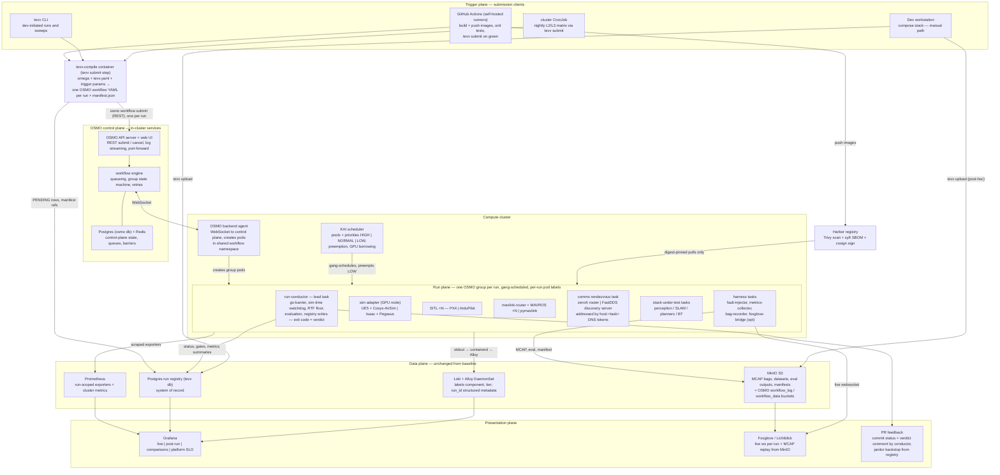

# Autonomy TEVV Platform — OSMO Orchestration Variant

- **Date:** 2026-07-13
- **Status:** Draft for review
- **Relationship to baseline:** supersedes the orchestration mechanics (§7, parts of §8/§11/§13) of [`2026-07-10-autonomy-tevv-architecture-design.md`](2026-07-10-autonomy-tevv-architecture-design.md). Everything domain-specific — omega contract, compiler, registry, data plane, fault injection, evaluation, observability — carries forward unchanged. The baseline remains the record of the Argo-native design and its rationale (ADR-001 context).
- **External review:** amended per [`reviews/2026-07-13-gemini-3.1-pro-osmo-review-disposition.md`](reviews/2026-07-13-gemini-3.1-pro-osmo-review-disposition.md) (5 findings: registry-derived attempts + attempt-scoped artifact prefix, registry-backed auto-cancel, intra-group NetworkPolicy semantics, `ignoreNonleadStatus: false`, preemption exit code 3006).
- **Deliverable:** this spec + `diagrams/system-architecture-osmo.mermaid`; doc-set and plan amendments listed in §14.

## 1. Purpose and scope

Replace the platform's generic orchestration layer — Argo Events + Argo Workflows + partitioned semaphores + the Kubernetes-mechanics half of run-conductor — with [NVIDIA OSMO](https://github.com/NVIDIA/OSMO) (Apache-2.0, self-hosted, v6.3.x), while preserving every contract, invariant, and data-plane decision of the baseline.

Grounding for this decision (verified against the OSMO repository and docs, 2026-07-13):

- OSMO **groups** gang-schedule concurrent tasks with a startup barrier and a single `lead` task whose exit code decides the group outcome — the exact shape of a TEVV run.
- **`{{host:<task_name>}}`** template tokens give live inter-task DNS; NVIDIA's own cookbook (`cookbook/ros/comm/ros2_comm.yaml`) runs a FastDDS discovery server as a task, with ROS 2 nodes dialing it by hostname — independently identical to baseline §5.4's unicast-rooted comms profiles.
- The **KAI scheduler** (open-source Run:AI) provides pools, HIGH/NORMAL/LOW priorities, real preemption, and GPU borrowing — natively solving the starvation problem the baseline worked around with partitioned semaphores (which exist only because Argo cannot preempt).
- Failure semantics distinguish backend errors (RESCHEDULED, incremented retry ID; exit 137 auto-reschedules) from task failures — a native carrier for the FAILED vs INFRA_FAILED invariant.
- Control plane: API server + workflow engine + web UI, backed by PostgreSQL and Redis, one backend agent per compute cluster (Helm, WebSocket back to control plane), tasks created as pods in a shared workflow namespace.

Out of scope: everything the baseline already fixes that OSMO does not touch (§2.3).

## 2. Decision context

### 2.1 Amended decisions

| # | Question | Baseline decision | This variant |
|---|----------|-------------------|--------------|
| 6 | Architecture shape | Approach A: Argo-native pipeline, thin registry | Approach A': OSMO control plane as the orchestration layer; registry unchanged as system of record; compiler unchanged, gains `--target osmo` |
| 8 (new) | Scheduler | Partitioned Argo semaphores (`gpu-sim-interactive`/`gpu-sim-batch`) | KAI pools + priorities with preemption: PR smoke HIGH, merge NORMAL, nightly/sweeps LOW-preemptible |
| 9 (new) | Run isolation | Namespace per run (`tevv-run-<run_id>`) | Shared OSMO workflow namespace; per-run isolation via run-labeled pods + per-run NetworkPolicy delivered through OSMO group templates; comms containment via unicast rendezvous (unchanged) |
| 10 (new) | Inbound trigger | Webhook → Argo Events EventSource → per-tier Sensors | `tevv submit` client step (CI job, CLI, CronJob) = tevv-compile + OSMO REST submit. CI-vendor-agnostic is preserved: anything that can run one container can submit |

### 2.2 What does not change

Omega contract and tevv.yaml schemas; tevv-compile as the single multi-artifact compiler (digest pinning, interface/QoS checks, fault-capability checks, matrix expansion, `manifest.json` provenance); the run registry as system of record with the `(run_id, attempt)` identity and generated verification matrix; MinIO/MCAP with rolling segment upload; Loki/Alloy logging topology; Prometheus metrics rules (gates always from MCAP post-processing); Grafana + Foxglove presentation incl. presigned-URL replay; fault-injection backends and timeline; sim-time authority, lockstep, RTF floor, and the probe rule; Harbor as the sole artifact source; the manual compose path and `tevv upload`; test taxonomy L0–L3 and tier→trigger mapping; platform SLO (INFRA_FAILED rate < 5%).

### 2.3 Why switch (and the honest cost)

Gains: real preemption instead of queue partitioning; gang scheduling with startup barrier as a platform primitive instead of conductor code; retries/reschedules as configuration; inter-task DNS instead of per-run Services; a workflow UI, log streaming, and `port-forward`/`exec` for interactive debugging of cluster runs; a native growth path to HIL (sim-on-GPU + policy-on-Jetson gang groups) above L3.

Costs (managed in §11/§13/§16): operating a control-plane service (Postgres + Redis + API server + engine + agent + KAI) at pilot scale; a young open-source project (public since 2025-10); no native webhook/cron triggering; shared-namespace isolation model; undocumented Kyverno and air-gap posture. The compiler's multi-target design is the standing exit ramp: the Argo baseline remains renderable from the same resolved model until this variant proves itself (§13).

## 3. System overview

Standalone source: `diagrams/system-architecture-osmo.mermaid`. The manual path (baseline §3.1) is unchanged; an OSMO data-flow diagram joins the doc set if this variant is adopted (§14).

## 4. Test taxonomy

Unchanged (baseline §4). All tiers still flow through the orchestrator so every verdict lands in the registry. Tier-to-scheduling mapping:

| Tier | Trigger | OSMO pool | Priority |
|------|---------|-----------|----------|
| L0 | every commit | `cpu` (`gpu-inference` for perception models) | NORMAL |
| L1 | PR open/update | `gpu-sim` | HIGH |
| L2 | merge, nightly | `gpu-sim` | NORMAL |
| L3 / sweeps | nightly, on-demand | `gpu-sim` | LOW (preemptible) |

A preempted LOW run is rescheduled by OSMO from scratch as a new attempt (§8); sweeps therefore tolerate preemption at run granularity by design.

## 5. Omega contract and compiler

Schemas and the three-layer merge are unchanged. `tevv-compile` gains `--target osmo` as a third renderer of the same resolved model (beside `k8s` and `compose`): one OSMO workflow YAML per expanded run, containing a single group whose tasks are the resolved components, harness, and comms rendezvous. Renderer mapping:

| Resolved model element | OSMO workflow element |
|------------------------|-----------------------|
| run (matrix point) | one workflow, name = `run_id`. OSMO workflows carry no labels/metadata — suite/tier/pr/sha live only in the registry row; the compiler injects the `{{workflow_id}}` token into the conductor env so it can write `workflow_ref` without an API call |
| pod topology | one `group` with `ignoreNonleadStatus: false` (any task death fails the whole gang — OSMO's default would restart a dead task alone mid-run, and a fresh-state SITL rejoining a mid-mission run corrupts it silently); every pod becomes a `task`; run-conductor is `lead: true` |
| comms profile `fastdds-ds` | discovery-server task; participants get `ROS_DISCOVERY_SERVER` from `{{host:<ds-task>}}` |
| comms profile `zenoh` | zenoh-router task (`rmw_zenohd`); participants get `RMW_IMPLEMENTATION=rmw_zenoh_cpp` + connect endpoint `tcp/{{host:<router-task>}}:7447` |
| per-run ClusterIP Service (baseline §5.4) | not emitted — `{{host:}}` tokens replace it; the TCP dial-wait in participant entrypoints stays |
| sim/autopilot config, evaluation.yaml, bag allowlist | injected via task `files:` and object-store inputs |
| resource profiles (tevv.yaml) | task `resources` + platform targeting to pool node classes |
| phase budgets | workflow `exec_timeout` / `queue_timeout` (wall-clock, per baseline time-base rules) |
| verdict/infra mapping | lead exit-code contract + `exitActions` (§8) |

`manifest.json` additionally records the rendered OSMO workflow spec digest. The compose path and today's four scenario presets are untouched.

## 6. Fault injection

Unchanged (baseline §6). The fault-injector runs as a harness task inside the group; `fault_events`, `/fault_state`, fault-scoped gates, and the four backends are identical. The userspace mavlink-proxy needs no elevated privileges, so the shared-namespace model (§7) does not affect it.

## 7. Orchestration and run plane

- **Submission**: `tevv submit` = run the tevv-compile container, then POST each run bundle's workflow to the OSMO API (`osmo workflow submit` semantics) and insert PENDING registry rows with manifest URIs. The same step runs in a GitHub Actions job (after image push to Harbor), the tevv CLI, or a cluster CronJob for nightly matrices. OSMO has no webhook/cron triggering — this thin client step is the replacement for Argo Events, and it keeps the trigger surface CI-vendor-agnostic.
- **Scheduling**: KAI pools with guarantees/limits per node class; priorities per §4. Preemption replaces the baseline's semaphore partition and its hand-tuned slot split; GPU borrowing recovers idle capacity. Hardware growth = pool quota edits.
- **Auto-cancel**: OSMO has no workflow labels or label-query API, so the registry is the lookup: the submit step queries `tevv.runs` for non-terminal rows with the same `trigger_ref` + suite, cancels each by exact `workflow_ref` via the OSMO API, and marks those runs ABORTED.
- **Group topology**: as the baseline pod list (§7), one task per pod, gang-scheduled with OSMO's implicit startup barrier (`barrier: true`, the default) so no task starts before all images are pulled and containers ready. All tasks keep explicit ephemeral-storage requests/limits.
- **run-conductor, slimmed**: remains the lead task and the sole sim-time authority, keeping the semantic go-barrier (sim RPC answers, SITL heartbeats, MAVROS connected, contract topic rates, `/clock` ticking, TF sane), the watchdog (topic liveness vs sim time, RTF floor, pod-crash policy), phase budgets, evaluation orchestration, registry writes, and PR feedback posting. It sheds: namespace creation, bundle application, teardown, retry logic, and semaphore handling — all owned by OSMO. OSMO's container-ready barrier is necessary but not sufficient; the semantic barrier stays because "container running" ≠ "sim answering RPC".
- **Isolation**: pods run in the shared OSMO workflow namespace with per-run labels (`tevv.io/run-id`, plus the group UUID). Per-run NetworkPolicies are delivered as auxiliary namespace-scoped resources via OSMO group templates, using `{{WF_GROUP_UUID}}` for per-group resource uniqueness (the documented pattern for concurrent workflows in one namespace). Policy semantics — this is a shared namespace, so intra-run traffic must be allowed explicitly: **allow ingress/egress between pods of the same group** (peer selector on the group-UUID label — DDS discovery, zenoh, sim RPC, MAVLink all ride inside the run), **allow egress to data-plane endpoints** (MinIO, registry, Loki push is node-level), **default-deny everything else** — which is what actually isolates concurrent runs from each other. OSMO's own optional NetworkPolicy (which permits unrestricted internet egress) is disabled — it contradicts the no-runtime-internet rule. DDS/zenoh cross-run containment is doubly guaranteed: unicast rendezvous scoping plus the peer-only policy.

## 8. Run lifecycle and failure handling

Run states, the FAILED vs INFRA_FAILED invariant, `(run_id, attempt)` identity, `mission_timeout = FAILED`, the failure-reason taxonomy, `flaky_suspect` quarantine, and the platform SLO are all unchanged (baseline §8). What changes is ownership of transitions:

| Transition | Baseline owner | OSMO-variant owner |
|------------|----------------|--------------------|
| PENDING → PREPARING | Argo semaphore acquisition + conductor | KAI schedules the gang; conductor stamps PREPARING |
| PREPARING → READY → RUNNING → EVALUATING | conductor | conductor (unchanged) |
| EVALUATING → PASSED/FAILED | evaluator + conductor exit code | same; lead exit code is the group outcome |
| → INFRA_FAILED → PENDING (retry ≤ 2) | conductor + Argo retry | lead exits with the infra exit code; OSMO `exitActions` reschedule the group; conductor stamps the new attempt |
| → ABORTED | pre-submit cancel via Argo API | pre-submit cancel via OSMO API |
| orphan/stuck reconciliation | janitor CronWorkflow (namespace sweep) | janitor reconciler: OSMO workflow states ↔ registry rows (no namespaces to sweep) |

**Lead exit-code contract** (rendered into every workflow by the compiler):

| Lead exit code / event | Meaning | OSMO exitAction | Registry outcome |
|------------------------|---------|-----------------|------------------|
| 0 | all gates green | none (success) | PASSED |
| 1 | gate(s) violated — real verdict | none — **never retried** | FAILED |
| 42 | platform fault detected by conductor (readiness timeout, sim crash, RTF collapse, topic stall) | reschedule, cap 2 | INFRA_FAILED → new attempt |
| 137 | SIGKILL/OOM | reschedule (OSMO default for 137) | INFRA_FAILED → new attempt |
| 3006 / group `FAILED_PREEMPTED` | preempted by KAI for a higher-priority workflow | reschedule | new attempt; counts toward SLO |
| any non-lead task death (with `ignoreNonleadStatus: false`) | gang member died — clean-slate reschedule, never a partial restart | group fails → reschedule | INFRA_FAILED (`pod_crash`/`sim_crash`) → new attempt |

Attempts: OSMO exposes no retry/attempt token, so the registry is the attempt authority — at start the conductor allocates `attempt = max(attempt for run_id) + 1` and writes the new `(run_id, attempt)` row. Harness tasks (recorder, metrics-collector) must not bake artifact paths at render time: they obtain `{run_id, attempt}` from the conductor over the run's coordination surface (the conductor serves run metadata at `{{host:<conductor-task>}}`; harness tasks block on it as part of taking their own barrier station) and upload under the attempt-scoped prefix (§9). When the whole group is torn down before the lead can classify (non-lead death, preemption), the conductor's SIGTERM grace handler snapshots diagnostics best-effort and the janitor closes the row from OSMO task statuses (preempted vs crashed → `failure_reason`). Verdicts attach to the final attempt; the SLO counts attempts. The probe rule is unchanged: readiness probes for ordering only, no liveness probes on sim-time-dependent pods, conductor is the liveness authority. Outputs note: OSMO does not upload task outputs on termination/preemption — irrelevant here because bags stream to MinIO via rolling segment upload during the run, not at exit (baseline §9.2 survives preemption by construction).

## 9. Data plane

Unchanged (baseline §9) with two additions and one schema delta:

- **OSMO backing services**: an `osmo` database on the existing CloudNativePG cluster (separate role/db from `tevv`), a Redis instance, and OSMO's object-store buckets (`workflow_log`, `workflow_data`) on MinIO. These are OSMO-internal; the TEVV registry remains the only system of record and no TEVV component reads OSMO's tables.
- **Attempt-scoped artifact prefix**: because reschedules re-run the recorder with static task config, the run prefix gains an attempt segment — `tevv-runs/<yyyy>/<mm>/<run_id>/<attempt>/{bags,eval,video,logs,manifest.json}` — so a rescheduled attempt can never overwrite or interleave with its predecessor. This matches the `artifacts` PK `(run_id, attempt, s3_uri)`. Manual-path `tevv upload` writes attempt `1`. Harness tasks learn the attempt at runtime from the conductor (§8).
- **Registry schema delta**: the orchestrator reference column is neutral:

| Column | Type | Nullable | Indexing | Scale / retention |
|--------|------|----------|----------|-------------------|
| workflow_ref (replaces argo_workflow_id) | text (OSMO workflow id) | yes | — | join key for OSMO UI deep links and janitor reconciliation |

Logging, metrics, MCAP handling, retention classes, and the telemetry-writer/ClickHouse growth path are identical to baseline.

## 10. Observability and presentation

Unchanged (baseline §10), plus: the OSMO web UI and CLI log streaming become a supplementary live view (task states, queue position, live logs); `osmo workflow port-forward` covers the dev loop for the live Foxglove websocket, while the ingress path `/runs/<id>/ws` is served by a per-run Service delivered via group template, exactly as the NetworkPolicies are. Grafana deep links gain the OSMO workflow URL from `workflow_ref`.

## 11. Security and DevSecOps/MLSecOps

Baseline §11 posture carries forward: Harbor as the single artifact source (OSMO injects `imagePullSecrets` into its workflow namespace), External Secrets Operator, no inline secrets in omega/tevv schemas, models-as-components. Deltas and open risks:

- **AuthN/Z**: OSMO sits behind the same OIDC SSO as Grafana/MinIO. OSMO's auth integration is on its public roadmap for simplification — verify the IdP flow during P1 deployment.
- **Admission**: Kyverno signed-image enforcement on the OSMO workflow namespace is undocumented upstream; the platform certification suite (§12) must prove pods created by the backend agent pass admission before any suite depends on OSMO.
- **NetworkPolicy**: OSMO's bundled internet-egress policy is disabled; per-run default-deny policies via group templates (§7). The outbound-events, query, and artifact integration surfaces are unchanged.
- **Air gap**: OSMO's install docs assume outbound access to container registries and the OSMO service. All images route through Harbor regardless (pull-through + mirrors, baseline §11); an air-gapped OSMO control-plane install is unvalidated upstream and is an explicit adoption gate (§16).

## 12. Platform self-testing

Baseline §12 carries forward (compiler golden tests now include `--target osmo` fixtures; the compose/k8s equivalence test becomes compose/osmo). Additions: the canary suite runs after every OSMO or KAI upgrade before the nightly matrix; a scheduler-behavior test asserts that a HIGH submission preempts a running LOW canary and that the preempted run reschedules and completes (guarding the §4 policy); an admission test asserts Kyverno-signed-image enforcement holds for agent-created pods (§11).

## 13. Phasing

| Phase | Delivers | Demonstrable proof |
|-------|----------|--------------------|
| **P0 Foundations** | Unchanged from baseline (registry, `tevv` CLI upload, MinIO/Loki/Grafana, Harbor flow) — OSMO not involved | A manual compose run lands in the registry with bags, logs, dashboard |
| **P1 First automated loop** | OSMO control plane + backend agent + KAI deployed; **P1 spike** (see below); compiler `--target osmo`; slimmed conductor; one L1 planner smoke suite; PR feedback | PR-triggered sim run end-to-end through OSMO: verdict comment + Grafana + Foxglove replay |
| **P2 Breadth** | Unchanged (L0 replay, tiers, fault-injector, sweeps, comparisons, QoS check) — sweeps gain preemptible LOW class | One report compares 3 planner configs from a sweep; L0 gates on every commit |
| **P3 Hardening & growth** | Unchanged + optional HIL pilot (sim + Jetson gang group) above L3 | Second sim engine passes certification; HIL smoke if pursued |

**P1 spike (adoption gate, time-boxed)** — before committing the loop to OSMO, prove on the real cluster: (1) attempt distribution — a forced reschedule produces a second `(run_id, attempt)` row and a separate attempt-scoped MinIO prefix with no cross-contamination; (2) Kyverno admission interplay; (3) group-template delivery of per-run NetworkPolicy + Service, including that intra-group traffic flows and cross-run traffic is denied; (4) exit-action mapping fidelity for the §8 contract **at group level with `ignoreNonleadStatus: false`** — a killed non-lead task must reschedule the gang (not restart solo) and respect the retry cap; (5) OIDC flow. Failure of the spike falls back to the Argo baseline at near-zero cost: the compiler still renders `--target k8s`, and the registry, conductor semantics, and data plane are orchestrator-agnostic by construction.

## 14. Deliverable doc set and plan impact

If adopted, the existing implementation plan (`docs/superpowers/plans/2026-07-10-tevv-architecture-doc-set.md`) is amended, not rewritten — P0 tasks (1–4, 6, 10 data plane, 12 handoffs, 13) are orchestrator-agnostic and unaffected except the DDL column rename:

- `schemas/registry.sql`: `argo_workflow_id` → `workflow_ref` (Task 4).
- `architecture/04-run-plane.md` (Task 9): rewritten to this spec's §7.
- `architecture/07-lifecycle-failures.md` (Task 9): ownership table + exit-code contract from §8.
- New `ADR-008-osmo-orchestrator.md` (Task 5): supersedes the orchestration mechanics of ADR-001 and the namespace decision of ADR-004; records the P1 spike as the adoption gate. ADR-007's tier policy survives with pools/priorities as the mechanism.
- `diagrams/system-architecture-osmo.mermaid` (this spec) replaces `system-architecture.mermaid` as the 00-overview sync source; a data-flow variant is produced alongside.
- P1-era handoffs (`tasks/`, planned-not-written): conductor handoff loses namespace/teardown scope; webhook→Argo wiring handoff becomes `tevv submit` + OSMO deployment handoff.

## 15. Requirements coverage

All baseline §15 rows remain satisfied; the rows whose mechanism changed:

| Original requirement | Where addressed now |
|----------------------|---------------------|
| Commit → CI → orchestrator → omega YAML → pods in K8s | §7 submission via `tevv submit` → OSMO REST → gang-scheduled group |
| Manual and automated runs | §3 manual path unchanged; automated via OSMO; both land in one registry |
| Headless sim + streaming to Foxglove | §10 — unchanged, plus OSMO port-forward for the dev loop |
| Easy DevSecOps/MLSecOps integration | §11 — same four surfaces; OSMO REST is an additional inbound programmatic surface |

## 16. Deferred decisions (variant-specific, in addition to baseline §16)

| Decision | Trigger to decide | Owner |
|----------|-------------------|-------|
| Adopt OSMO for the automated loop (vs Argo baseline) | P1 spike outcome (§13) | zhihan |
| Air-gapped OSMO control-plane install pattern | Air-gap mandate lands; upstream docs currently assume connectivity | platform owner |
| OSMO HA/backup posture (Postgres `osmo` db, Redis) | Before P2 (sweeps make the control plane load-bearing) | platform owner |
| HIL tier above L3 via OSMO edge-device gang groups | Hardware bench availability; P3+ | zhihan |
| `rmw_zenoh` in component base images (zenoh profile prerequisite, unchanged from compose) | First zenoh-profile suite on cluster | component owners |
