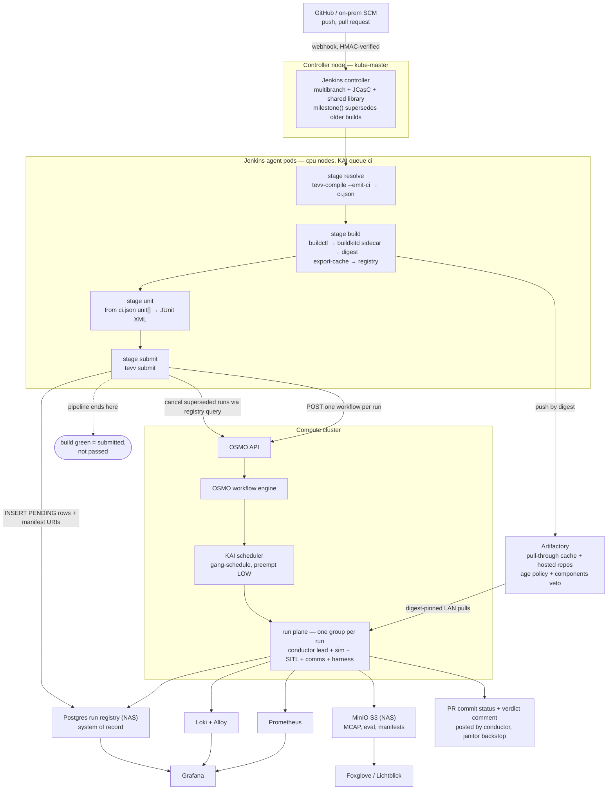

# Autonomy TEVV Platform — Jenkins CI Plane

- **Date:** 2026-08-18
- **Status:** Draft for review
- **Relationship to prior specs:** supersedes the CI/trigger-plane assumptions of [`2026-07-10-autonomy-tevv-architecture-design.md`](2026-07-10-autonomy-tevv-architecture-design.md) (§3 trigger plane, §11 surface 1) and [`2026-07-13-autonomy-tevv-osmo-orchestration-design.md`](2026-07-13-autonomy-tevv-osmo-orchestration-design.md) (§3 trigger plane, §7 submission). Orchestration, omega contract, registry, run plane, data plane, and presentation plane carry forward unchanged. OSMO remains the orchestration layer per the variant, still P1-spike-gated.
- **Deliverable:** this spec + `ADR-009-jenkins-ci.md` + diagram amendments listed in §14.

## 1. Purpose and scope

Replace GitHub Actions self-hosted runners with Jenkins as the platform's CI and submission client, and specify the image/disk lifecycle that in-cluster CI makes mandatory.

The vendor substitution itself is nearly free. A repository-wide grep finds GitHub referenced in **twelve lines**, all in the trigger plane; nothing below it names a CI vendor. That is by construction:

- Baseline §4: *"CI runners execute only image build + pure unit tests. Everything that produces a test verdict goes through [the orchestrator], so all results land in one registry with full traceability."*
- Baseline §11 surface 1 already names Jenkins as an anticipated caller.
- Variant §7: *"`tevv submit` … runs in a GitHub Actions job, the tevv CLI, or a cluster CronJob … it keeps the trigger surface CI-vendor-agnostic."*
- PR feedback is posted by the **run-conductor** with a janitor backstop (baseline §8, variant §3), not by CI. The migration does not touch the feedback path.

**The actual architectural change is that CI moves from outside the cluster to inside it.** The baseline diagram places GHA self-hosted runners in `subgraph TP["Trigger plane — outside cluster"]`: separate machines, separate disks, separate scheduler, separate image cache. Jenkins with dynamic Kubernetes pod agents places build workload *inside the compute cluster*, contending with sim runs for the same scheduler, node disks, containerd image store, and NAS. Every material risk in this spec follows from that relocation, not from Jenkins.

In scope: Jenkins topology and placement; the `ci.json` resolve contract; two schema additions the requested developer workflow requires; node placement and scheduler integration; the image and disk lifecycle; workflow and coupling semantics; security deltas; capacity analysis.

Out of scope, recorded as dependencies in §12: the substitution of Docker Hub for Harbor, relocation of Postgres and MinIO to a NAS, and the eventual air-gapped Artifactory. These contradict baseline §11 and §9.1 and warrant their own design pass.

## 2. Decision context

### 2.1 Amended decisions

Continuing the numbering of baseline §2.2 (1–7) and variant §2.1 (8–10).

| # | Question | Prior decision | This spec |
|---|----------|----------------|-----------|
| 11 | CI vendor and submission client | GitHub Actions, self-hosted runners | Jenkins: controller + dynamic Kubernetes pod agents, **BuildKit** builds via an ephemeral per-pod `buildkitd` sidecar, JCasC-managed |
| 12 | CI execution locus | Outside the cluster | Inside the cluster. Creates scheduler, disk, and image-cache contention that did not previously exist and must be designed against (§7, §8) |
| 13 | CI ↔ verdict coupling | Implicit: CI fires and forgets; conductor reports | Explicit fire-and-forget. Jenkins terminates at submit; a green build means *submitted*, not *passed* (§9.2) |
| 14 | Contract dereferencing | Not specified | `tevv-compile` is the sole reader of omega.yaml and tevv.yaml. CI consumes a resolved `ci.json`, never raw contract YAML (§5) |

### 2.2 What does not change

The omega contract's three-layer merge; tevv-compile's pipeline and multi-target rendering; the run registry as system of record with `(run_id, attempt)` identity and generated verification matrix; OSMO groups, gang scheduling, KAI pools and priorities; the lead exit-code contract and `ignoreNonleadStatus: false`; registry-derived attempts and the attempt-scoped artifact prefix; run-conductor semantics including sim-time authority, go-barrier, watchdog, RTF floor, and the probe rule; the FAILED vs INFRA_FAILED invariant and the <5% platform SLO; MinIO/MCAP rolling segment upload; Loki/Alloy topology; Prometheus rules and MCAP-derived gates; Grafana and Foxglove presentation; PR feedback ownership; test taxonomy L0–L3 and tier→trigger mapping; the manual compose path and `tevv upload`.

### 2.3 Why switch, and the honest cost

The strongest argument is one that was not the stated motivation. The declared end state is an **air-gapped** artifact store (§12). GitHub webhooks cannot reach an air-gapped Jenkins, so the SCM must eventually move on-prem as well — and GitHub Actions structurally cannot follow across that boundary, whereas Jenkins is self-hosted and SCM-agnostic by design. This migration and the removal of Docker Hub are therefore the same project: **eliminating the last hosted-SaaS dependencies from the critical path.** Sequencing the SCM move as a known future step, rather than discovering it, is the difference between a planned migration and an outage.

Secondary gains: builds become schedulable resources with explicit quotas rather than opaque processes on a runner box; the ephemeral-workspace property of pod agents structurally eliminates the workspace and log accumulation that plagued the self-hosted runners (§8.1).

Costs: a new stateful single point of failure (§4.1); scheduler and disk contention created by moving CI in-cluster (§7, §8); a new inbound webhook surface and a namespaced pod-security exception for the BuildKit sidecar (§10); and a discipline requirement — Jenkins configured through the UI rather than JCasC is incompatible with this repository's Architecture-as-Code premise and makes the SPOF unrebuildable.

## 3. System overview



Standalone source: `diagrams/jenkins-ci-flow.mermaid`. Everything from `API` downward is unchanged from variant §3. `tevv submit` was already specified as a plain container precisely so this substitution would be a pipeline stage rather than a redesign.

## 4. Trigger plane — Jenkins topology

### 4.1 Controller

The Jenkins controller runs on the cluster's control-plane node alongside kube-apiserver, etcd, and the OSMO control plane. This concentrates three critical services in one failure domain and requires two mitigations:

- **`JENKINS_HOME` must not share a device with etcd.** etcd is fsync-latency-bound; Jenkins build-log and artifact writes on the same device drive fsync p99 into the range where etcd flaps leader elections. The downstream failure is apiserver stalls → OSMO backend-agent WebSocket drops → in-flight groups die → `INFRA_FAILED`. That is the worst available failure mode for this platform, because baseline §8 sets a <5% INFRA_FAILED SLO on the premise that *developers must never chase platform flakiness as their bug*. A platform whose own CI manufactures INFRA_FAILED violates its own reason for existing.
- **The controller must be rebuildable from git.** Configuration-as-Code (JCasC) plus Job DSL, with `JENKINS_HOME` holding only mutable state. Recovery is then a redeploy, not a restore of a backup nobody has tested.

### 4.2 Agents

Dynamic Kubernetes pod agents via the Jenkins Kubernetes plugin. One ephemeral pod per build; the workspace dies with the pod.

Image builds use **BuildKit**, run as an **ephemeral `buildkitd` sidecar container inside the agent pod**. The build container talks to it over a unix socket on a shared `emptyDir`; both die with the pod. There is no Docker daemon and no Docker socket, so per-build layers never enter the node image store (§8.1), and no build state survives a build (§8.5 control 4).

Kaniko was the original choice and is **no longer viable**: the upstream repository was archived on 2025-06-03 and is read-only, with the maintainers retired. An unmaintained builder holding registry push credentials accrues unpatched CVEs indefinitely, which is not an acceptable posture for the component that signs and pushes every platform image.

Two consequences of the substitution, both real:

- **`buildkitd` is a daemon.** Kaniko was a single-shot binary; BuildKit is a service that must be placed. The sidecar placement is chosen over a shared cluster-wide builder specifically to preserve ephemerality — a long-lived builder keeps a local layer cache on a PVC or node disk under BuildKit's own GC rather than kubelet's, which would reintroduce a fifth accumulation store (§8.4) of exactly the kind this design exists to eliminate. The shared builder is faster and remains a deferred option (§16).
- **The security posture is weaker than Kaniko's, not stronger** (§10). This is the cost of the change and it is not hidden.

Agent pods are constrained by §7: `nodeSelector` to cpu nodes, `schedulerName: kai-scheduler`, a dedicated capped KAI queue, and explicit ephemeral-storage requests and limits.

### 4.3 Pipeline structure

Multibranch pipelines per component repository plus one for the integration repository. All pipeline logic lives in a **Jenkins shared library** that wraps the four stages, so a component repository's `Jenkinsfile` is approximately five lines. With 5–15 developers across N component repositories, hand-rolled Jenkinsfiles would re-scatter exactly the schema knowledge that decision 14 centralises.

`milestone()` supersedes older in-flight *builds* on the same branch. This is distinct from, and complementary to, run-level supersession (§9.3).

## 5. The `ci.json` resolve contract

**Decision 14 exists to prevent a specific silent-divergence bug.** Raw `omega.yaml` is the unmerged, unvalidated, unresolved document: it exists before tevv.yaml defaults are merged and before trigger params override anything (baseline §5.1's three layers). A pipeline stage that parses it directly acts on values that differ from what the run actually executes, with no failure signal. It would also scatter schema knowledge across N Jenkinsfiles, re-creating the migration cost this design avoided.

`tevv-compile` therefore gains `--emit-ci`, a resolve-only mode that performs layers 1–4 of the §5.2 pipeline (schema validation, component resolution with digest pinning, interface and QoS checks, fault-capability checks) and emits `ci.json` **without** matrix expansion or bundle rendering. Build stages consume `ci.json`; the later `submit` stage runs the full compile.

| Key | Type | Contents |
|-----|------|----------|
| `schema_version` | string | Contract version; Jenkins shared library pins a supported range |
| `compiler_version` | string | tevv-compile image digest — same value recorded in `manifest.json` |
| `trigger` | object | `{repo, sha, pr, tier, reason}` — baseline §5.1 layer 3, resolved |
| `integration_ref` | string | Pinned integration-repo ref the omega set was resolved at (§9.4) |
| `build[]` | array | Per component: `{component, context, dockerfile, image_repo, tag, cache_repo, resources}` |
| `unit[]` | array | Per unit suite: `{component, name, image, command, timeout_sec, resources, artifacts, required}` — resolved from tevv.yaml `unit_tests` (§6.2) |
| `suites[]` | array | Per selected suite: `{suite, omega_digest, estimated_runs}` |
| `submit` | object | `{osmo_endpoint, secret_refs, supersede_key}` |

One parser, one schema, one source of truth. The CLI and CronJob submission paths consume the identical artifact, so vendor-agnosticism is preserved mechanically rather than by convention.

## 6. Schema additions

### 6.1 Sampled matrix — Monte Carlo

`matrix:` today is a cross-product of explicit lists (baseline §5.2 step 5, §5.3). Monte Carlo requires distributions, a sample count, and a seed.

```yaml
matrix:
  mode: sample                 # product (default, current behaviour) | sample
  samples: 200
  seed: 42                     # REQUIRED when mode is sample
  axes:
    faults[0].params.vector_ms[0]:
      dist: normal
      mu: 8.0
      sigma: 2.0
      clamp: [0.0, 20.0]
    scenario.origin.yaw_deg:
      dist: uniform
      lo: 0
      hi: 360
    local-planner.params.max_vel:
      dist: choice
      values: [2.0, 4.0, 6.0]
      weights: [0.25, 0.5, 0.25]
```

Rules:

1. `mode: product` is the default and is byte-identical to current behaviour. The addition is backward compatible.
2. `seed` is mandatory under `mode: sample`; its absence is a compile error. Baseline §5.2's entire premise is that `manifest.json` makes any run reproducible, and a sampled run without a recorded seed breaks that guarantee.
3. **Per-run seed is derived, not sequential:** `run_seed = H(seed, run_index)`. This makes sampling *append-only reproducible* — re-running sample *k* reproduces exactly, and raising `samples` from 200 to 400 leaves the first 200 draws untouched.
4. Each run's resolved draw is written to `manifest.json` and to `runs.matrix_point`. That column is already `jsonb` with a GIN index (baseline §9.1), so sampled sweeps are queryable for cross-run analysis with **no registry schema change**.
5. Distributions at v1: `normal`, `uniform`, `loguniform`, `choice`. Deliberately small.
6. A compile-time cap on `samples` prevents a typo submitting an unbounded workflow burst; exceeding it is a compile error, not a truncation.

Capacity note: 200 samples against 1–2 `gpu-sim` slots is a multi-day sweep. This is correctly classified L3/sweeps → LOW-preemptible under variant §4, and variant §8 already makes preemption a fresh attempt rather than a lost run.

### 6.2 `unit_tests:` block in tevv.yaml

Baseline §4 places pure unit tests outside the omega contract: CI runs them, they produce no registry verdict, and everything that *does* produce a verdict flows through the orchestrator into one registry. The developer-facing requirement — one declarative file per repository driving every stage — is satisfiable without weakening that invariant, provided the block is placed correctly.

Unit tests are **per-component** and belong with the code, in `tevv.yaml`. `omega.yaml` is **per-suite** and lives in the integration repository; placing unit tests there would force a developer to edit another team's repository to change their own component's tests.

```yaml
component: local-planner
type: ros2-node
image: { repo: local-planner, dockerfile: docker/Dockerfile }

unit_tests:                    # NEW — CI-only, never a registry verdict
  - name: gtest-core
    command: ["colcon", "test", "--packages-select", "local_planner"]
    timeout_sec: 600
    resources: { cpu: "4", memory: "8Gi", ephemeral-storage: "20Gi" }
    artifacts: ["build/**/test_results/**/*.xml"]
    required: true             # false = advisory, does not fail the build

l0_tests:                      # existing — replay tests, DO produce registry verdicts
  - name: replay-costmap
    dataset: ds-costmap-2026-03
    verifies: [REQ-NAV-012]
```

**The boundary is enforced by the schema, not by documentation.** `verifies:` is legal in `omega.yaml`; its presence inside `unit_tests` is a schema error — `additionalProperties: false` rejects it, which was verified against `jsonschema` 4.25.1 rather than assumed. A developer therefore cannot accidentally create a requirements-traceability claim from a test result that never reaches the registry. This converts baseline §4's rule from a convention into a mechanical guarantee.

Resolution: `unit[]` entries in `ci.json` (resolved from `unit_tests`) run in a Jenkins agent pod and report as build status plus JUnit test report. `l0_tests` entries compile to OSMO workflows and write registry rows. The governing rule is *the contract declares, the compiler resolves, and where the result lands depends on tier*.

## 7. Node placement and scheduler integration

### 7.1 The KAI blind spot

KAI manages pools, quotas, priorities, and preemption for OSMO workflow pods. Jenkins Kubernetes-plugin pods are scheduled by the **default kube-scheduler** unless explicitly configured otherwise. KAI's accounting then believes capacity exists that a build burst has already consumed; KAI gang-schedules a run, the pods cannot fit, the startup barrier times out, and the run is recorded `INFRA_FAILED` — attributed to the platform and counted against the SLO.

Baseline and variant contain nothing about this because CI was outside the cluster. It is new surface area created by decision 12.

**Requirement:** Jenkins agent pod templates set `schedulerName: kai-scheduler` and are bound to a dedicated KAI queue with a hard CPU/memory quota, sized so that a maximally parallel build burst cannot encroach on `gpu-sim` guarantees.

### 7.2 Placement rules

| Workload | Placement | Enforcement |
|----------|-----------|-------------|
| Jenkins controller | control-plane node, `JENKINS_HOME` on a device separate from etcd | Explicit PV; node affinity |
| Jenkins agent pods | cpu nodes only | `nodeSelector` + toleration absent for the gpu-sim taint |
| OSMO run-plane pods | per KAI pool node classes (`gpu-sim`, `gpu-inference`, `cpu`) | Unchanged from variant §4 |
| `gpu-sim` nodes | run pods only | Taint `tevv.io/gpu-sim:NoSchedule`, tolerated only by run-plane pods |

The taint does three jobs simultaneously: it keeps build I/O off the sim node's disk, keeps CI images out of the sim node's image-GC LRU pool (§8.2), and keeps build pods off etcd's device.

### 7.3 The RTX 2080 Ti

The control-plane node carries a weaker GPU. 11 GB VRAM is not a comfortable fit for UE5 5.5.4 + Cosys-AirSim, and the node already hosts etcd, the Jenkins controller, and the OSMO control plane. The spec already defines a node class that fits the hardware — **`gpu-inference`** for perception-model L0 tests — but §7.1's contention argument applies to GPU work as much as to builds.

**Recommendation: schedule nothing on that node until control-plane load is measured under a representative build burst plus a concurrent sim run.** If headroom is demonstrated, admit it as `gpu-inference` only. Recorded as an open decision (§16).

## 8. Image and disk lifecycle

### 8.1 What in-cluster CI changes about disk

Persistent self-hosted runners accumulate three things: per-build image layers, workspaces, and logs. Dynamic pod agents structurally eliminate two — the pod dies, the workspace dies with it. With the BuildKit sidecar there is no Docker daemon on the agent: base-image layers and `buildkitd`'s local cache live inside the pod and are destroyed with it, while the reusable layer cache is exported to the registry — so **per-build layers never enter the node image store**. CI's steady-state contribution to node image growth is three small, stable images (`inbound-agent`, rootless `buildkit`, `tevv-compile`) that should be cached.

That ephemerality is the entire reason the sidecar was chosen over a shared cluster builder: a long-lived `buildkitd` holds its local cache on a PVC or node disk under BuildKit's own GC rather than kubelet's, which would add a fifth accumulation store (§8.4) of exactly the kind this design exists to eliminate.

Two problems relocate rather than disappear:

- **Build logs still accumulate, on the Jenkins controller.** Console output goes to `JENKINS_HOME/jobs/*/builds/*/log`, not to the agent, and default retention is unbounded. Filling that device does not merely break CI; per §4.1 it threatens etcd.
- **CI images now share an image store with sim images.** Under GHA, runner disk pressure broke CI on a machine nobody depended on. Under pod agents, node disk pressure evicts *runs*. The accumulation is smaller but lands inside the blast radius of the thing being protected.

### 8.2 Why default kubelet image GC is backwards for this workload

Two kubelet thresholds sit adjacent: image GC begins at roughly 85% imagefs usage, and hard pod eviction fires at roughly 15% imagefs available — the same point. There is no comfortable margin between reclamation and eviction.

kubelet evicts images **least-recently-used**. This workload pairs a tens-of-GB sim image used only when a sim run happens with many small CI images churning daily. LRU will evict the sim image to make room for build layers; the next PR-triggered L1 run then pays a full cold pull *inside the OSMO startup barrier, with the GPU already reserved and idle*. If `imageMaximumGCAge` is configured, it is worse: it evicts by idle age irrespective of free disk, targeting the sim image specifically.

### 8.3 The disk-pressure feedback loop

Disk pressure is amplifying rather than degrading, because of an interaction with a policy that is otherwise correct:

```text
disk fills → kubelet DiskPressure → pod evicted
  → evicted pod is a non-lead task
  → ignoreNonleadStatus: false (variant §5) → whole gang fails
  → OSMO exitAction reschedules → fresh gang re-enters the pull phase
  → the images kubelet just evicted to relieve pressure must be re-pulled
  → more disk consumed → repeat
```

The loop closes because the reclamation that relieved the pressure deleted precisely the images the rescheduled gang then needs. It terminates only at the retry cap of 2. One disk-pressure event therefore costs three GPU-slot occupancies and three `INFRA_FAILED` attempts — and variant §8 is explicit that the SLO counts attempts. The gang-integrity policy is right for sim fidelity; the mitigation belongs on the disk side.

### 8.4 Accumulation stores and owners

| Store | Contents | Reclaimed by | Default | Risk rank |
|-------|----------|--------------|---------|-----------|
| Artifactory / registry (NAS) | one image per component per commit | registry retention policy | unbounded | 1 — fastest growth |
| `JENKINS_HOME` (control-plane node) | build logs, archived artifacts | Jenkins `buildDiscarder` | unbounded | 2 — threatens etcd |
| containerd image store, per node | sim, SITL, ROS, conductor, harness, 3 CI images | kubelet image GC | LRU above ~85% | 3 — wrong-thing eviction, not growth |
| Node ephemeral / `emptyDir` | build workspaces, `buildkitd` local cache and scratch, bag segments pre-upload | kubelet eviction | unbounded without limits | 4 — bounded once limits set |

There is deliberately **no fifth row**. A shared `buildkitd` would add one — a persistent local cache under BuildKit's GC rather than kubelet's — which is why the sidecar placement was chosen (§4.2). Revisiting it is a deferred decision (§16), not a free optimisation.

### 8.5 Controls, in dependency order

1. **Pull-through cache first — prerequisite for everything else.** Artifactory (or Harbor as placeholder) as a registry proxy, with cluster and Jenkins pointed at it exclusively. A cache miss becomes a **LAN pull instead of a WAN pull**, which is what makes aggressive GC safe: once eviction is cheap, LRU behaviour stops being a run-latency problem. It simultaneously restores baseline §11's single-artifact-source invariant and makes air-gap day a proxy toggle (§12).
2. **Pin sim images against LRU.** containerd image pinning (`io.cri-containerd.pinned=pinned`), which kubelet excludes from GC — verify support against the deployed kubelet and containerd versions. Portable fallback: a **warmer DaemonSet** on `gpu-sim` nodes holding a paused container referencing the image, since images in use by a running container are never collected.
3. **Taint `gpu-sim`; pin agents to cpu nodes.** Per §7.2.
4. **BuildKit layer cache to the registry, not node disk.** `--export-cache type=registry,ref=<registry>/cache,mode=max` plus `--import-cache type=registry,ref=<registry>/cache`. Converts an ungoverned node-disk problem into a registry-storage problem that control 6 governs. Pair with `emptyDir.sizeLimit` on **both** the workspace and the `buildkitd` state volume, so a runaway build is evicted alone rather than taking the node down.

   **Regression to note.** Kaniko's `--cache-ttl` defaulted to 336h — two weeks — which coincided with the PR-smoke artifact retention class (baseline §9.2), so cache entries self-expired on the same clock as the artifacts of the runs that produced them. **BuildKit's registry cache has no TTL**; it is an ordinary image in a registry. The cache repository must therefore be named explicitly in control 6, and `mode=max` (which exports intermediate layers) makes it materially larger than Kaniko's was. A real cost of moving off an archived tool, recorded rather than glossed.
5. **Extend baseline §7's ephemeral-storage rule to build pods.** The spec already mandates explicit ephemeral-storage requests and limits on all run pods so disk pressure can never evict the sim. That rule was written when CI lived outside the cluster; widening its scope to agent pods is a one-line amendment to an already-justified decision and is what prevents a build from evicting a run.
6. **Registry retention: age-based policy with a traceability veto.** There is a real tension — `manifest.json` pins every input digest for reproducibility (baseline §5.2), while per-commit builds across 5–15 developers grow the NAS without bound. Age alone would silently destroy reproducibility for runs the platform has promised to keep. Baseline §9.1 already stores the answer: the `components` table records `(run, repo, SHA, image digest)` for every run. The rule is therefore: **an age-based Artifactory policy prunes by default; a query over `tevv.components` joined against `runs`/`artifacts` retention status vetoes deletion of any digest still referenced by a non-expired run.** Images inherit the retention classes baseline §9.2 already defines (PR smoke 14 d, merge/nightly 90 d, release-tagged indefinite), with the invariant **image retention ≥ artifact retention for the same run**. The **BuildKit cache repository is governed separately and unconditionally**: it carries no provenance and nothing references it, so the `components` veto must *not* apply — a plain 14-day age policy on the cache repo, restoring by configuration the TTL Kaniko enforced for free. The SQL is a safety interlock, not a scheduler — reproducibility protection for the cost of a query rather than a service.
7. **`buildDiscarder` and log rotation via JCasC**, plus verification of `--container-log-max-size` / containerd log rotation on all nodes — the remaining unbounded log path, and the one feeding Alloy→Loki.

### 8.6 Alerting

Baseline §2.1 lists among the defects to design around: *"Elasticsearch disk-watermark incidents silently dropped run results."* This failure class has already occurred, silently, and constitutes a standing design obligation that is currently unmet for node disk.

| Signal | Threshold | Rationale |
|--------|-----------|-----------|
| Node filesystem utilisation | warn at 70% | Well below kubelet's ~85% GC threshold, so warning precedes reclamation, let alone eviction |
| Image pull duration, p95 | suite-specific baseline | Detects a pull-through cache that has stopped serving |
| kubelet image GC rate | any sustained activity on `gpu-sim` nodes | Detects LRU thrash against the pinned sim image |
| `JENKINS_HOME` utilisation | warn at 70% | Shares a failure domain with etcd (§4.1) |

node-exporter and cadvisor are already deployed (baseline §2.1), so this is dashboard and rule work, not new infrastructure.

### 8.7 Memory (recorded, not a workstream)

No RAM exhaustion has been observed. Sizing notes only: the Jenkins controller JVM requires `-XX:MaxRAMPercentage` against an explicit pod memory limit, since an uncapped heap under a limit is a deterministic OOMKill; the `buildkitd` sidecar needs its own memory request/limit sized for the largest layer set, and it is a *second* container competing for the pod's budget; the control-plane node requires `system-reserved` and `kube-reserved` so a build burst cannot starve kubelet; and on sim nodes a single OOMKilled sidecar exits 137, which under `ignoreNonleadStatus: false` fails the gang and maps to *reschedule* in variant §8 — so a systematically undersized memory limit does not fail loudly but becomes a guaranteed three-attempt burn appearing as INFRA_FAILED noise.

## 9. Workflow

### 9.1 Stages

| Stage | Agent | Action |
|-------|-------|--------|
| resolve | pod (`tevv-compile`) | `tevv-compile --emit-ci` → `ci.json` (§5) |
| build | pod (`buildctl` → `buildkitd` sidecar) | Build each `build[]` entry, push by digest, export cache to registry |
| unit | pod (per `unit[]` image) | Run unit suites; publish JUnit XML as build status |
| submit | pod (`tevv-compile`) | Full compile → run bundles; supersede; POST workflows to OSMO; INSERT PENDING rows |

### 9.2 Coupling: fire-and-forget

**Jenkins terminates at submit.** The conductor owns the verdict and posts PR commit status and the verdict comment, with the janitor as backstop (baseline §8). A green Jenkins build means *submitted*, not *passed*.

Alternatives considered and rejected:

- **Block and poll.** Jenkins polls until terminal and mirrors the verdict as its build result. This holds an executor for the full run duration, and variant §8 makes a LOW-priority sweep **preemptible and fully reschedulable underneath the poller** — an unbounded wait. It also creates two authorities on one run, since a Jenkins `timeout` and OSMO `exec_timeout` can disagree. The webhook-callback remedy is unavailable: OSMO has no webhook mechanism (variant §7), so the *conductor* would have to call Jenkins, placing a Jenkins-specific dependency inside the conductor and destroying the vendor-agnosticism variant §7 exists to protect.
- **Hybrid** — block on L0 only (CPU, every commit, fast), fire-and-forget for L1–L3. Legitimate, and the only defensible form of blocking. Held as a P2 refinement if developers report friction on L0 specifically; not built initially.

**Mitigation for the resulting UX gap:** the submit stage writes deep links into the Jenkins build description — OSMO workflow URL (from `workflow_ref`), Grafana run dashboard, and a registry query for the run set. The Jenkins build page points at the truth rather than duplicating it.

### 9.3 Supersession is two-layered

| Layer | Mechanism | Window covered |
|-------|-----------|----------------|
| Build | Jenkins `milestone()` | A newer commit arrives while an older build is still building or testing |
| Run | Submit-stage registry query: non-terminal `tevv.runs` rows with matching `trigger_ref` + suite, cancelled by exact `workflow_ref` via the OSMO API, marked ABORTED (variant §7) | A newer commit arrives after submission, while runs are queued or executing |

Both are required; neither covers the other's window.

### 9.4 Suite resolution for component-repository triggers

A component repository contains no `omega.yaml` — that file lives in the integration repository (baseline §5.1). When Jenkins builds `local-planner` on a PR, something must answer *which suites verify this component* before submission. Baseline §4 supplies the tier (PR → L1 smoke) and baseline §9.1's `suites` and `components` tables hold the data, but the resolution rule was never stated because nothing read it. A multibranch pipeline must be told.

**Rule:**

1. The trigger supplies `{repo, sha, tier}` per baseline §5.1 layer 3 and the §4 tier mapping.
2. `--emit-ci` resolves the integration repository's omega set at a **pinned ref** — default the integration repository's `main`, overridable by trigger param.
3. A suite is selected when its `tier` matches the trigger tier **and** the triggering component appears in its resolved `stack[].component`.
4. An explicit `suites:` trigger param overrides selection entirely, for CLI and on-demand runs.
5. The resolved `integration_ref` is recorded in `ci.json` and in `manifest.json`.

Step 5 matters: without a pinned, recorded integration ref, a moving integration repository makes component-repository PR results non-reproducible, which would breach baseline §5.2's provenance guarantee.

## 10. Security deltas

Baseline §11's posture carries forward. Changes:

- **New inbound surface.** Jenkins requires an internet-reachable HTTPS webhook endpoint; GitHub Actions required none. HMAC signature verification is mandatory, and the endpoint is the one component whose exposure must be revisited at air-gap time (§12).
- **Credentials via External Secrets Operator, not `JENKINS_HOME`.** Registry push credentials, the Kubernetes ServiceAccount token, the OSMO API token, and the registry Postgres role all resolve through ESO. Jenkins sits behind the same OIDC SSO as Grafana, MinIO, and OSMO.
- **Kyverno signed-image admission is currently unenforceable.** Baseline §11 requires that run namespaces admit only signed Harbor images, with cosign signatures, Trivy scans, and syft SBOMs produced at push. Pulling from Docker Hub leaves that control with nothing to enforce against. Control 8.5.1 is the remedy; until it lands, the admission policy is aspirational. Tracked in §12.
- **Agent pods require a documented privilege exception — this is the cost of the builder change.** The earlier Kaniko design ran builds in an ordinary unprivileged pod. Rootless BuildKit on Kubernetes does not: upstream's reference rootless manifest sets `seccompProfile: Unconfined` **and** `appArmorProfile: Unconfined`, and requires `buildkitd --oci-worker-no-process-sandbox`, whose own startup warning reads *"NoProcessSandbox allows build containers to kill (and potentially ptrace) an arbitrary process in the BuildKit host namespace."* Because that namespace is the sidecar's own container and the pod is single-tenant and ephemeral, the blast radius is one build — but it is still a real relaxation and must be granted explicitly, not inherited by accident:
  - a **namespaced Pod Security Admission exception** for the CI namespace only (`restricted` cannot admit Unconfined profiles), never cluster-wide;
  - a **Kyverno policy scoped to the CI namespace** permitting the two Unconfined profiles solely for the `buildkitd` container image, by digest;
  - run-plane namespaces keep the unmodified `restricted` posture — the exception must not reach them.

  The alternative is BuildKit's `userns` variant, which avoids the Unconfined profiles but requires the `UserNamespacesSupport` feature gate on **both** kubelet and kube-apiserver. That is a cluster-wide change with its own review, deferred (§16).
- **Still no Docker socket and no privileged container.** The relaxation above is seccomp/AppArmor scope, not `privileged: true` and not host mounts. That distinction should survive review intact.

## 11. Limiting factors

Ranked for the deployed topology: small cluster; control-plane node hosting kube-master, Jenkins, the OSMO control plane, and an RTX 2080 Ti; Postgres and MinIO on a NAS; images from Docker Hub pending Artifactory.

| # | Limiting factor | Binding? | Mitigation |
|---|-----------------|----------|------------|
| 1 | **Image pull time, charged against the GPU.** OSMO gang-schedules with a startup barrier (variant §7): KAI reserves the GPU *first*, then pods pull, and the slowest pull in the gang gates the run. Tens-of-GB sim images, designed-in preemption of LOW sweeps, and one NAT'd IP against Docker Hub rate limiting compound this. Every reschedule (variant §8) re-enters the pull phase; whether that costs a pull depends on node cache state, and cache misses are likeliest precisely when disk pressure caused the reschedule (§8.3). | **Yes** — cold pull can exceed the mission it precedes | §8.5.1 pull-through cache; §8.5.2 pinning |
| 2 | **The single strong-GPU sim slot.** Unchanged from baseline §2.2 decision 2 (1–2 concurrent GPU sim runs). | Yes, by design | None. **Migrating CI buys zero additional throughput**; if runs/day is the constraint, Jenkins is not the remedy |
| 3 | **etcd fsync contention.** Pod agents do not fix this alone — build pods landing on the control-plane node still write to etcd's device. | Yes if unmitigated | §4.1 device separation; §7.2 taints |
| 4 | **KAI blind spot for agent pods.** Builds consume capacity KAI believes is free → barrier timeouts recorded as INFRA_FAILED. | Yes if unmitigated | §7.1 `schedulerName` + capped queue |
| 5 | **Node ephemeral disk**, with the §8.3 amplification loop. | Yes if unmitigated | §8.5 controls 4–7; §8.6 alerting |
| 6 | **Jenkins controller as triple-stacked SPOF** (kube-master + OSMO control plane + CI, one failure domain). | Availability, not throughput | §4.1 JCasC rebuildability |
| 7 | **RTX 2080 Ti** — 11 GB VRAM, on the busiest node. | Only if used for sim | §7.3 — schedule nothing there pending measurement |
| 8 | **NAS bandwidth.** Postgres and MinIO share one link. Default bag rates are modest because baseline §5.3's `record.topics` allowlist is deliberately narrow, but enabling camera topics or `video/*.mp4` capture (baseline §9.2) would let MCAP uploads starve registry writes. | Latent | Separate pools/volumes if supported; confirm link speed |

Items 1 and 4 did not exist under GitHub Actions and are created purely by decision 12. Neither is a reason to avoid the migration; both are inexpensive to design around now and expensive to diagnose later, when they present as INFRA_FAILED noise indistinguishable from genuine platform flakiness — the precise confusion baseline §8 exists to prevent.

## 12. Infrastructure dependencies and open decisions

Recorded, not designed here. Each contradicts a decision in the baseline or variant and warrants a separate design pass.

| Item | Conflicts with | Consequence | Disposition |
|------|----------------|-------------|-------------|
| **Container images from Docker Hub** | Baseline §11: *"Harbor is the single artifact source… the cluster pulls only from Harbor → air-gapping later = stop mirroring, nothing else changes"* | Per-IP rate limiting becomes a throughput ceiling (limiting factor 1); Kyverno signed-image admission has nothing to enforce (§10); air-gap becomes a migration rather than a policy change. Additionally, Hub pulls are **currently failing on the development machine** with a credential error as of 2026-07-13, which already blocks plan Task 4's `postgres:16` | Stand up the pull-through cache now (§8.5.1). This is the single highest-leverage item in this spec |
| **Postgres on a NAS** | Baseline §9.1: CloudNativePG in-cluster, WAL-archived to MinIO | If exported over NFS, Postgres fsync and locking semantics are hazardous and a NAS interruption can wedge or corrupt the **system of record**, losing every verdict and the verification matrix. Over iSCSI/block this is a non-issue | Confirm export type. Block export: proceed. NFS: escalate to a design decision |
| **MinIO on a NAS** | Baseline §9.2 (in-cluster) | Beneficial — bag segments leave node disk immediately, materially reducing §8 pressure | Proceed; confirm NAS link speed against limiting factor 8 |
| **OSMO's Postgres and Redis** | Variant §9 assumes both on the existing CloudNativePG cluster | Redis on network storage is inadvisable regardless of export type; it requires local disk for AOF | Keep Redis node-local |
| **Air-gapped Artifactory replacing Harbor** | Baseline §11's Harbor-specific supply chain (Trivy, syft, cosign) | Artifactory's equivalent scanning is a separately licensed capability; signing and SBOM generation need re-siting | Design pass before P2 |
| **GitHub as SCM vs the air-gap end state** | §2.3 | GitHub webhooks cannot reach an air-gapped Jenkins. The SCM must move on-prem, and this is the strongest argument for the migration | Sequence explicitly; do not discover |

## 13. Phasing

| Phase | CI-plane delivery | Proof |
|-------|-------------------|-------|
| **P0** | Pull-through cache (§8.5.1); Jenkins controller with JCasC; shared library; `--emit-ci` and the `ci.json` contract (§5); build stage; `buildDiscarder`; disk alerting (§8.6) | A component PR builds and pushes a digest-pinned image with no Docker Hub in the pull path |
| **P1** | `unit_tests` schema and unit stage (§6.2); suite resolution (§9.4); submit stage; agent KAI queue + taints (§7); sim-image pinning (§8.5.2) | PR-triggered sim run end-to-end through Jenkins → OSMO: verdict comment posted by the conductor, deep links in the Jenkins build description |
| **P2** | Sampled matrix (§6.1); registry retention with `components` veto (§8.5.6); hybrid L0 blocking if warranted (§9.2) | A 200-sample Monte Carlo sweep completes with per-run seeds recorded in `manifest.json` and reproducible on re-run |
| **P3** | SCM relocation on-prem; air-gap posture for the webhook surface (§10, §12) | A full PR-to-verdict cycle with no egress beyond the perimeter |

P1 remains gated on the OSMO adoption spike (variant §13). Nothing in P0 depends on that outcome — the CI plane is orchestrator-agnostic, and a fallback to the Argo baseline changes only the submit stage's target.

## 14. Doc set and plan impact

| Artifact | Change |
|----------|--------|
| `diagrams/system-architecture-osmo.mermaid` | `GHA` node → Jenkins controller; **split the trigger plane**, placing agent pods inside the compute cluster, since that relocation is the architectural change (§1) |
| `diagrams/system-architecture.mermaid` | Same substitution for the Argo baseline, retained as the fallback record |
| `diagrams/jenkins-ci-flow.mermaid` | New — §3 diagram as a standalone source |
| Baseline §11 surface 1 | Jenkins promoted from anticipated caller to current caller |
| Baseline §15, variant §15 | "Commit → GitHub Action → …" row restated vendor-neutrally |
| `architecture/08-security-devsecops.md` (plan Task 11) | Webhook surface, ESO credentials, the Kyverno gap (§10) |
| `architecture/03-scenario-compiler.md` (plan Task 8) | `--emit-ci` mode and the `ci.json` contract (§5); sampled matrix expansion (§6.1) |
| `schemas/tevv.schema.json` (plan Task 3) | `unit_tests` block; `verifies:` prohibited inside it (§6.2) |
| `schemas/omega.schema.json` (plan Task 3) | `matrix.mode`, `samples`, `seed`, distribution axis forms (§6.1) |
| `adr/ADR-009-jenkins-ci.md` | New (§14.1) |
| Plan Task 12 handoff index | Add Jenkins deployment + shared library handoff; the existing `tevv submit` handoff gains the `ci.json` contract |

### 14.1 ADR-009 outline

**Context:** GitHub Actions self-hosted runners are the current CI plane; the declared end state is an air-gapped artifact store and, by implication, an on-prem SCM, which GitHub Actions cannot follow. Past operational experience with self-hosted runners is unbounded accumulation of images, workspaces, and logs.

**Options:** (a) retain GitHub Actions and defer the air-gap conflict; (b) Jenkins with static agents on the controller box; (c) Jenkins with dynamic Kubernetes pod agents.

**Decision:** (c). Ephemeral pods structurally eliminate workspace and log accumulation on agents; the BuildKit sidecar keeps per-build layers out of node image stores and dies with the pod; Jenkins is self-hosted and SCM-agnostic, so it survives the air-gap transition. Coupled decisions: fire-and-forget (§9.2); compiler-only contract dereferencing (§5); agent pods scheduled by KAI under a capped queue (§7.1); **BuildKit rather than Kaniko** (archived upstream 2025-06-03, maintainers retired — an unmaintained builder holding registry push credentials is an unacceptable posture), placed as an ephemeral per-pod sidecar rather than a shared cluster builder, so ephemerality is preserved at the cost of warm-cache speed.

**Consequences:** CI relocates inside the cluster, creating scheduler and disk contention absent from the prior design and requiring §7 and §8 in full. The BuildKit substitution costs a namespaced pod-security exception (§10) and the loss of Kaniko's 336h cache TTL, which control 6 must now supply by configuration (§8.5). A new stateful SPOF is co-located with kube-master and the OSMO control plane, mitigated by JCasC rebuildability. Baseline §7's ephemeral-storage rule widens to build pods. Supersedes the GHA assumption in baseline §3 and variant §3; ADR-007's tier policy and ADR-008's orchestration decision are unaffected.

## 15. Requirements coverage

| Requirement | Where addressed |
|-------------|-----------------|
| Commit → CI → orchestrator → omega YAML → pods in K8s | §3, §9.1 — Jenkins stages → `tevv submit` → OSMO |
| One declarative contract per repository driving every stage | §5 `ci.json`, §6.2 `unit_tests` — satisfied without weakening baseline §4 |
| Sim Monte Carlo parameter sweeps | §6.1 — sampled matrix with recorded per-run seeds |
| ROS 2 parameter overrides | Unchanged — `stack[].params`, validated against tevv.yaml schemas |
| ROS 2 middleware / RMW substitution | Unchanged — baseline §5.4 `middleware` and `comms` axes; variant §5 OSMO rendering |
| Unit tests declared with the component, run in CI, excluded from the registry | §6.2 — schema-enforced via the `verifies:` prohibition |
| Requirements traceability first-class | Preserved: only orchestrator-produced results carry `verifies:`, so the verification matrix cannot be polluted by CI-only results |
| Manual and automated runs converge on one registry | Unchanged — baseline §3.1 |
| Air-gap-clean artifact flow | §8.5.1 restores it; §12 records the outstanding conflicts |

## 16. Deferred decisions

| Decision | Trigger to decide | Owner |
|----------|-------------------|-------|
| Whether the control-plane node admits `gpu-inference` work on the RTX 2080 Ti | Control-plane load measured under a representative build burst plus concurrent sim run (§7.3) | zhihan |
| NAS export type for Postgres (block vs NFS) | Before P0 registry deployment (§12) | platform owner |
| Hybrid L0 blocking in Jenkins (§9.2 option C) | Developer friction reported on L0 feedback latency | zhihan |
| Artifactory scanning/signing equivalent to Harbor's Trivy + syft + cosign | Before P2 (§12) | security team |
| On-prem SCM selection and migration timing | Air-gap mandate date (§2.3, §12) | zhihan |
| Distribution families beyond `normal`/`uniform`/`loguniform`/`choice` | First sweep whose model is not expressible in v1 (§6.1) | component owners |
| Shared cluster-wide `buildkitd` instead of the per-pod sidecar | Build latency becomes a measured complaint rather than a predicted one; requires governing a fifth accumulation store under BuildKit's own GC (§8.4) | platform owner |
| BuildKit `userns` variant instead of the Unconfined seccomp/AppArmor exception | Security review rejects the namespaced PSA exception; needs the `UserNamespacesSupport` feature gate on kubelet **and** kube-apiserver (§10) | security team |
